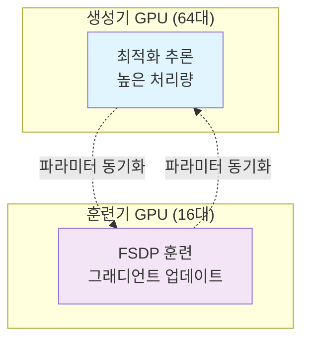

# 제3부: 실험 설계 및 방법론

## 1. 전체 실험 아키텍처

### 1.1 3단계 접근법
```
1단계: 기준 알고리즘 설정 (GRPO + DAPO 클리핑)
2단계: 개별 설계 축 소규모 실험 (3.5-4K GPU시간)
3단계: 안정적 조합 발견 시 대규모 실험 (16K GPU시간)
4단계: 최적 레시피 통합 및 100K GPU시간 검증
5단계: 다차원적 확장성 검증 (모델, 태스크 등)
```

### 1.2 컴퓨팅 환경 구성
- **하드웨어**: Nvidia GB200 GPU 80대
- **소프트웨어**: PyTorch, FSDP (Fully Sharded Data Parallel)
- **분산 처리**: 생성기-훈련기 분산 아키텍처

## 2. 생성기-훈련기 분산 아키텍처

### 2.1 아키텍처 개요



### 2.2 비동기 처리 방식 비교

#### PPO-off-policy-k 방식
- **동작 방식**: 배치 단위의 동기적 처리
- **과정**:
  1. 생성기: $B$개 프롬프트에 대한 $G$개 생성물 생성
  2. 훈련기: $\hat{B}$개 프롬프트씩 미니배치 처리
  3. 총 $k = B/\hat{B}$번 그래디언트 업데이트
- **한계**: 생성된 데이터의 스테일일 정도 높음

#### PipelineRL-k 방식 (채택)
- **동작 방식**: 스트리밍 방식의 연속 처리
- **과정**:
  1. 생성기: 지속적으로 생성물 생성 (스트림)
  2. 훈련기: 배치 준비 시 즉시 파라미터 업데이트
  3. 생성기: 업데이트된 파라미터로 즉시 적용 (KV 캐시 유지)
- **장점**: 오픈-정책(on-policy)에 가까운 훈련

### 2.3 최적 파라미터 설정
- **off-policyness**: $k=8$이 최적 (실험적으로 확인)
- **배치 크기**: 48 프롬프트 × 16 생성물 = 768 완성물
- **생성 길이**: 16,384 토큰 (12,288 생각 + 2,048 해답 + 2,048 프롬프트)

## 3. 데이터셋 및 평가 지표

### 3.1 훈련 데이터셋
- **주요 데이터셋**: Polaris-53K (수학 문제)
- **데이터 구성**:
  - 프롬프트: 수학 문제
  - 생성물: 생각 추론 + 최종 해답
  - 형식: `<think>...</think> <answer>...</answer>`
- **데이터 전처리**:
  - 사소한 프롬프트 제거
  - 12K 토큰 초과 솔루션 제거
  - AIME 2024/2025, MATH-500으로 오염 제거

### 3.2 검증 데이터셋
- **목적**: 훈련 중 성능 모니터링
- **구성**: Polaris-53K에서 무작위 추출 1,000개 프롬프트
- **평가 방식**: 100스텝 간격, 프롬프트당 16개 생성물
- **지표**: 평균 통과율 (mean@16)

### 3.3 하류 평가 벤치마크
- **수학**: AIME-24, MATH-500
- **코딩**: LiveCodeBench (2025년 1-6월)
- **평가 목적**: 훈련 분포 외 일반화 성능 검증

## 4. 기준 알고리즘 상세

### 4.1 GRPO 기반 알고리즘

#### GRPO 알고리즘의 개념적 이해

GRPO(Group Relative Policy Optimization)는 대규모 언어 모델의 강화학습 훈련을 위해 설계된 알고리즘입니다. 전통적인 PPO(Proximal Policy Optimization)를 기반으로 하되, 다음과 같은 핵심 특징을 가집니다:

**핵심 아이디어**: 동일 프롬프트에서 생성된 답변 그룹 내 상대적 품질 평가
- **목적**: 프롬프트 난이도 차이로 인한 편향을 제거하고 안정적 학습 유도
- **방식**: 개별 샘플의 절대적 보상 대신 그룹 내 상대적 품질을 평가
- **장점**: 별도의 가치 함수(critic) 없이 직접 보상을 사용하여 계산 효율성 향상
- **특징**: 시퀀스 전체가 아닌 각 토큰 수준에서 정책 업데이트 수행

#### 핵심 수식 상세 설명

**1. 중요도 샘플링 비율 (Importance Sampling Ratio)**
$$
\rho_{i,t}(\theta) = \frac{\pi_{\theta}^{\text{train}}(y_{i,t})}{\pi_{\theta_{\text{old}}}^{\text{gen}}(y_{i,t})}
$$

**각 기호의 의미**:
- $\rho_{i,t}(\theta)$: $i$번째 생성물의 $t$번째 토큰에서의 중요도 샘플링 비율
- $\pi_{\theta}^{\text{train}}(y_{i,t})$: 현재 훈련 정책이 $t$번째 토큰 $y_{i,t}$를 생성할 확률
- $\pi_{\theta_{\text{old}}}^{\text{gen}}(y_{i,t})$: 이전 생성 정책이 $t$번째 토큰 $y_{i,t}$를 생성할 확률
- $\theta$: 현재 모델 파라미터
- $\theta_{\text{old}}$: 이전 모델 파라미터

**직관적 이해**: 이 비율은 정책 업데이트가 얼마나 '보수적'이어야 하는지를 결정합니다. 값이 1에 가까울수록 현재 정책과 이전 정책이 유사함을 의미합니다.

**2. 비대칭 클리핑 함수 (Asymmetric Clipping Function)**
$$
\text{clip}_{\text{asym}}(\rho, \epsilon^{-}, \epsilon^{+}) = \text{clip}(\rho, 1-\epsilon^{-}, 1+\epsilon^{+})
$$

**각 기호의 의미**:
- $\epsilon^{-}$: 하방 클리핑 임계값 (감소 방향 제한)
- $\epsilon^{+}$: 상방 클리핑 임계값 (증가 방향 제한)
- $\text{clip}(\cdot, \cdot, \cdot)$: 값이 지정된 범위를 벗어날 때 경계값으로 제한하는 함수

**직관적 이해**: DAPO에서 도입된 개념으로, 정책 개선과 다양성 유지 사이의 균형을 맞춥니다:
- 하방 클리핑($1-\epsilon^{-}$): 급격한 성능 저하 방지
- 상방 클리핑($1+\epsilon^{+}$): 과도한 최적화로 인한 엔트로피 붕괴 방지

**3. 그룹 내 어드밴티지 (Group-wise Advantage)**
$$
\hat{A}_i = r_i - \text{mean}(\{r_j\}_{j=1}^G)
$$

**각 기호의 의미**:
- $\hat{A}_i$: $i$번째 생성물의 어드밴티지 (그룹 내 상대적 가치)
- $r_i$: $i$번째 생성물의 보상 (일반적으로 ±1)
- $G$: 동일 프롬프트에서 생성된 총 생성물 수
- $\text{mean}(\{r_j\}_{j=1}^G)$: 동일 그룹 내 모든 생성물의 평균 보상

**직관적 이해**: 절대적 보상이 아닌 그룹 내 상대적 성능을 측정하여, 프롬프트의 난이도 차이로 인한 편향을 제거합니다.

**4. 정규화된 어드밴티지 (Normalized Advantage)**
$$
\hat{A}^G_i = \frac{\hat{A}_i}{\text{std}(\{r_j\}_{j=1}^G) + \epsilon}
$$

**각 기호의 의미**:
- $\hat{A}^G_i$: 정규화된 어드밴티지
- $\text{std}(\{r_j\}_{j=1}^G)$: 그룹 내 보상의 표준편차
- $\epsilon$: 수치적 안정성을 위한 작은 상수 (일반적으로 $10^{-8}$)

**직관적 이해**: 어드밴티지를 표준화하여 학습 안정성을 높이고, 다양한 난이도의 프롬프트에 대해 일관된 학습을 가능하게 합니다.

### 4.2 손실 함수 상세 분석

$$
J(\theta) = \mathbb{E}_{x \sim D, \{y_i\}_{i=1}^G \sim \pi_{\theta_{\text{old}}}^{\text{gen}}(\cdot|x)}
\left[ \frac{1}{G} \sum_{i=1}^G \frac{1}{|y_i|} \sum_{t=1}^{|y_i|} \min\left( \rho_{i,t}(\theta) \hat{A}^G_i, \text{clip}_{\text{asym}}(\rho_{i,t}(\theta), \epsilon^{-}, \epsilon^{+}) \hat{A}^G_i \right) \right]
$$

**손실 함수의 구조적 분석**:

**1. 기댓값 연산자**:
- $\mathbb{E}_{x \sim D, \{y_i\}_{i=1}^G \sim \pi_{\theta_{\text{old}}}^{\text{gen}}(\cdot|x)}$: 데이터 분포 $D$에서 프롬프트 $x$를 샘플링하고, 이전 정책으로부터 $G$개 생성물을 샘플링하는 과정에 대한 기댓값

**2. 이중 평균화 구조**:
- $\frac{1}{G} \sum_{i=1}^G$: 생성물 수준의 평균화 (그룹 내 균등한 기여)
- $\frac{1}{|y_i|} \sum_{t=1}^{|y_i|}$: 토큰 수준의 평균화 (생성물 내 균등한 기여)

**3. PPO 스타일 클리핑**:
- $\min(\rho_{i,t}(\theta) \hat{A}^G_i, \text{clip}_{\text{asym}}(\rho_{i,t}(\theta), \epsilon^{-}, \epsilon^{+}) \hat{A}^G_i)$: 원래 어드밴티지와 클리핑된 어드밴티지 중 더 작은 값 선택

**알고리즘의 작동 원리**:

1. **안정적 업데이트**: 클리핑을 통해 단일 스텝에서의 파라미터 변화를 제한
2. **상대적 학습**: 그룹 내 어드밴티지를 통해 절대적 보상의 한계 극복
3. **다양성 유지**: 비대칭 클리핑으로 엔트로피 붕괴 방지

**실제 적용 예시**:

```
프롬프트: "2x + 5 = 15일 때, x의 값은?"
생성물 그룹 (G=4):
y₁: "x = 5" (r₁ = +1)
y₂: "x = 10" (r₂ = -1)
y₃: "x = 5" (r₃ = +1)
y₄: "방정식을 풀면..." (r₄ = -1)

어드밴티지 계산:
mean(r) = (1-1+1-1)/4 = 0
std(r) = 1
Â₁ = (1-0)/1 = +1
Â₂ = (-1-0)/1 = -1
Â₃ = (1-0)/1 = +1
Â₄ = (-1-0)/1 = -1
```

이러한 GRPO 알고리즘은 대규모 언어 모델의 추론 능력 향상을 위해 특별히 설계되었으며, 특히 수학적 추론과 같이 정답이 명확한 태스크에서 효과적입니다.

## 5. 통계적 유의성 확보 방법

### 5.1 반복 실험 설계
- **목적**: 알고리즘 성능의 통계적 유의성 확보
- **방법**: 3회 독립적인 ScaleRL 실행
- **측정 항목**: 점근 성능($A$), 효율성($B$), 중간점($C_{\text{mid}}$)

### 5.2 오차 범위 설정
- **$A$ 값 오차**: $\pm 0.02$ (통계적 유의성 기준)
- **$B$ 값 비교**: 동일한 $A$ 범위 내에서 $B$ 값으로 효율성 비교
- **신뢰도 검증**: 다른 피팅 구간에서 파라미터 안정성 확인

### 5.3 피팅 절차
1. **데이터 필터링**: 1.5K GPU시간 이전 데이터 제외
2. **그리드 서치**: 
   - $A \in \{0.450, 0.455, 0.460, ..., 0.800\}$
   - $C_{\text{mid}} \in [100, 40000]$ (100개 선형적 분할점)
3. **최적화**: SciPy의 `curve_fit`으로 최소 제곱합 기준 최적화

## 6. 실험 단계별 상세 내용

### 6.1 1단계: 기준 알고리즘 실험 (3.5-4K GPU시간)
- **목표**: 개별 설계 축의 영향력 파악
- **설계 축**:
  - 비동기 방식 (PPO-off-policy vs PipelineRL)
  - 손실 함수 타입 (DAPO vs GSPO vs CISPO)
  - 정밀도 처리 (FP16 vs FP32)
  - 길이 제어 (인터럽션 vs 페널티)

### 6.2 2단계: 안정적 조합 실험 (16K GPU시간)
- **목표**: 안정적인 조합 발견
- **실험 방식**: Leave-One-Out (LOO) 분석
- **LOO 절차**:
  1. ScaleRL 기준 설정
  2. 각 설계 축을 하나씩 기준값으로 변경
  3. 16K GPU시간 실행 및 성능 비교

### 6.3 3단계: 대규모 검증 (100K GPU시간)
- **목표**: 최종 레시피의 예측 가능성 검증
- **실험 조건**:
  - 8B 밀집 모델: 100K GPU시간
  - 17B×16 MoE 모델: 50K GPU시간
- **예측 방식**: 50K(8B) / 16K(MoE) 시점까지 피팅 후 나머지 예측

## 7. 실험 설계의 핵심 원칙

### 7.1 점진적 접근
- **작은 규모 시작**: 안정성 확인 후 규모 확대
- **통제된 변수**: 한 번에 하나의 변수만 변경
- **반복 가능성**: 다른 연구자가 재현 가능한 설계

### 7.2 효율적 컴퓨팅
- **단계적 확장**: 불필요한 컴퓨팅 낭비 방지
- **조기 중단**: 불안정한 실험 조기 종료
- **병렬 처리**: 최대한 컴퓨팅 자원 활용

### 7.3 데이터 기반 의사결정
- **객관적 지표**: 통과율 기반의 성능 평가
- **통계적 검증**: 충분한 반복 실험
- **예측 중심**: 작은 규모로 대규모 예측

## 8. 강의 핵심 메시지

> "잘 설계된 실험은 신뢰할 결과의 기초입니다.  
> 통계적 유의성과 재현성이 과학적 발견의 전제 조건입니다."

### 다음 강의에서 다룰 내용
- 제4부: 3가지 핵심 발견 상세 분석
- 제5부: ScaleRL 레시피의 구성 요소
- 제6부: 다차원적 확장성 검증 결과