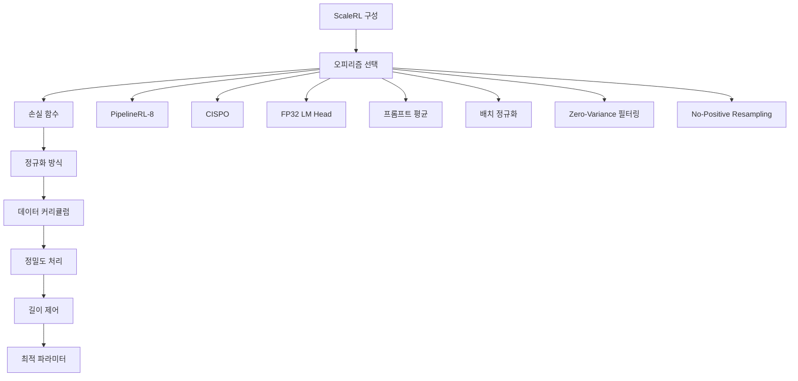

# 제5부: ScaleRL - 예측 가능한 RL 레시피

## 1. ScaleRL 구성 요소

### 1.1 핵심 아키텍처

### 1.2 각 구성 요소 상세 설명

#### 1.2.1 PipelineRL-8 (오피리즘)
- **선택 이유**: PPO-off-policy보다 2배 높은 효율성
- **동작 방식**: 스트리밍 방식의 연속 처리
- **핵심 장점**:
  - 생성기-훈련기 간의 지연 최소화
  - 오피리즘(on-policy)에 가까운 훈련
  - 유휴한 자원 활용

#### 1.2.2 CISPO (손실 함수)
$$
J_{\text{CISPO}}(\theta) = \mathbb{E}_{x \sim D, \{y_i\}_{i=1}^G \sim \pi_{\theta_{\text{old}}}^{\text{gen}}(\cdot|x)}
\left[ \frac{1}{T} \sum_{i=1}^G |y_i| \sum_{t=1}^{|y_i|} \text{sg}(\min(\rho_{i,t}, \epsilon_{\text{max}})) \hat{A}_i \log \pi_{\theta}^{\text{train}}(y_{i,t}) \right]
$$

- **특징**: Truncated Importance Sampling + REINFORCE
- **장점**: DAPO보다 높은 점근 성능과 안정성
- **하이퍼파라미터**: $\epsilon_{\text{max}} = 4$ (안정적)

#### 1.2.3 FP32 LM Head (정밀도)
- **문제점**: 생성기-훈련기 간의 수치적 불일치
- **해결책**: LM head에서 FP32 연산 강제
- **효과**: 점근 성능 0.52 → 0.61로 향상

#### 1.2.4 프롬프트 수준 평균 (손실 집계)
- **방식**: 각 프롬프트의 생성물을 동일 가중치로 평균
- **장점**: 토큰/샘플 평균보다 안정적
- **수식**:
$$
\text{Loss} = \frac{1}{P} \sum_{g=1}^P \frac{1}{|y_g|} \sum_{i=1}^{|y_i|} \text{sg}(\min(\rho_{i,t}, \epsilon)) \hat{A}^{\text{norm}}_i \log \pi_{\theta}^{\text{train}}(y_{i,t})
$$

#### 1.2.5 배치 수준 정규화 (어드밴티지 정규화)
- **방식**: 배치 내 모든 생성물의 어드밴티지 정규화
- **장점**: 통계적 안정성과 이론적 타당성
- **수식**:
$$
\hat{A}^{\text{norm}}_i = \frac{\hat{A}_i}{\sigma(\{\hat{A}_j\}_{j=1}^G)}
$$

#### 1.2.6 Zero-Variance 필터링
- **목적**: 영향력 없는 샘플 제거
- **기준**: 프롬프트 내 모든 생성물이 동일한 보상
- **효과**: 훈련 효율성 향상

#### 1.2.7 No-Positive Resampling (데이터 커리큘럼)
- **목적**: 쉬운 프롬프트의 반복 훈련 방지
- **기준**: 프롬프트 통과율 ≥ 0.9
- **효과**: 컴퓨팅 자원의 효율적 활용

## 2. ScaleRL 수학적 공식

### 2.1 최종 목적 함수
$$
J_{\text{ScaleRL}}(\theta) = \mathbb{E}_{x \sim D, \{y_i\}_{i=1}^G \sim \pi_{\theta_{\text{old}}}^{\text{gen}}(\cdot|x)}
\left[ \frac{1}{P} \sum_{g=1}^P |y_g| \sum_{i=1}^{|y_i|} \text{sg}(\min(\rho_{i,t}, \epsilon)) \hat{A}^{\text{norm}}_i \log \pi_{\theta}^{\text{train}}(y_{i,t}) \right]
$$

### 2.2 제약 조건
- $0 < \text{mean}(\{r_j\}_{j=1}^G) < 1$ (영향력 있는 프롬프트)
- $\text{pass\_rate}(x) < 0.9$ (쉬운 프롬프트 제외)

### 2.3 중요 파라미터 설정
| 파라미터 | 값 | 설명 |
|---------|-----|------|
| **off-policyness** | $k=8$ | PipelineRL 최적값 |
| **생성 길이** | 16,384 토큰 | 12,288 생각 + 2,048 해답 + 2,048 프롬프트 |
| **배치 크기** | 768 완성물 | 48 프롬프트 × 16 생성물 |
| **클리핑** | $\epsilon = 4$ | CISPO 최적값 |
| **인터럽션** | "Okay, time is up. Let me stop thinking and formulate a final answer now.