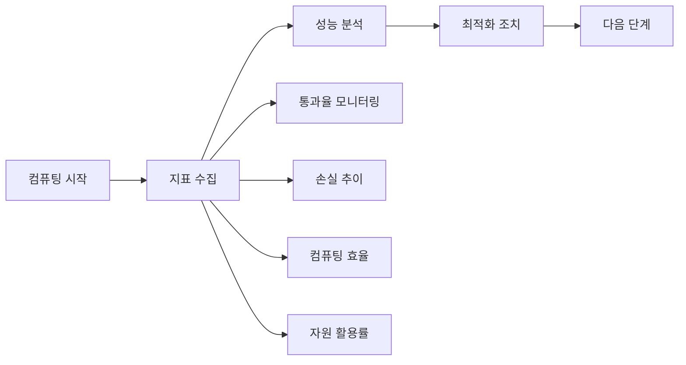

# 제6부: 실무 적용 및 미래 전망

## 1. 실제 프로젝트 적용 가이드

### 1.1 컴퓨팅 계획 수립 단계

#### 1단계: 사전 준비
- **하드웨어 요구사항**:
  - GPU: Nvidia A100/H100 이상 권장
  - 메모리: 모델 크기별 최소 80GB VRAM
  - 스토리지: 모델당 최소 1TB (체크포인트 포함)
  - 네트워크: 10Gbps 이상 대역폭 권장

- **소프트웨어 스택**:
  ```bash
  # 기본 RL 훈련 스택
  - PyTorch 2.0+
  - Transformers 4.30+
  - Accelerate (FSDP)
  - Weights & Biases
  - Ray (분산 처리)
  ```

- **데이터셋 준비**:
  - 도메인별 훈련 데이터 수집
  - 검증 데이터셋 구축 (10% 홀드아웃)
  - 데이터 품질 필터링 파이프라인 구축

#### 2단계: 초기 소규모 실험 (1-5K GPU시간)
- **목표**: 알고리즘 안정성 확인 및 기본 성능 측정
- **실험 설계**:
  - 기준 알고리즘: GRPO + DAPO
  - 모델: 1B-8B 파라미터
  - 배치 크기: 256-512
  - 평가: 100스텝 간격 검증

#### 3단계: 중간 규모 실험 (10-20K GPU시간)
- **목표**: 최적 알고리즘 조합 및 성능 향상
- **실험 설계**:
  - 알고리즘: ScaleRL 구성 요소 테스트
  - 모델: 8B 밀집 모델
  - 배치 크기: 768-1024
  - 평가: 다중 벤치마크 적용

#### 4단계: 대규모 훈련 (50K+ GPU시간)
- **목표**: 최종 성능 목표 달성 및 안정성 검증
- **실험 설계**:
  - 알고리즘: 최종 ScaleRL 레시피
  - 모델: 17B×16 MoE 또는 70B 밀집
  - 배치 크기: 2048+
  - 평가: 실제 프로덕션 환경 테스트

### 1.2 컴퓨팅 모니터링 및 최적화

#### 1.2.1 핵심 지표


#### 1.2.2 실시간 모니터링 대시보드
| 지표 | 수집 주기 | 경고 임계치 | 조치 방안 |
|------|------------|------------|------------|
| **통과율** | 100스텝 | < 60% | 알고리즘 변경 |
| **손실 변화** | 매스텝 | 급격한 증가 | 학습률 조정 |
| **컴퓨팅 효율** | GPU 활용률 | < 70% | 배치 크기 조정 |
| **생성 길이** | 평균 토큰 수 | > 15K | 길이 제어 적용 |
| **트렁션률** | 전체 배치 | > 10% | 안정성 검토 |

#### 1.2.3 자동 최적화 시스템
- **하이퍼파라미터 튜닝**:
  - 학습률: 1e-6 ~ 1e-5 범위
  - 배치 크기: 512 ~ 2048
  - 온도: 0.01 ~ 0.1
  - 클리핑: 0.1 ~ 0.5

- **최적화 알고리즘**:
  ```python
  # 예시: 컴퓨팅 효율 기반의 동적 배치 조정
  def optimize_batch_size(current_performance, target_efficiency):
      if current_efficiency < target_efficiency:
          return min(current_batch_size * 1.2, max_batch_size)
      else:
          return current_batch_size
  ```

## 2. 일반적인 함정과 해결책

### 2.1 흔한 문제점 및 해결 방안

#### 2.1.1 훈련 불안정성
- **증상**: 손실 발산, 성능 급격 하락, 모델 붕괴
- **원인**: 
  - 부적절한 학습률 설정
  - 너무 작은 배치 크기
  - 부적절한 데이터 전처리
  - 수치적 불안정성

- **해결책**:
  ```python
  # 안정성 체크포인트
  def stability_check():
      # 1. 손실 변화 모니터링
      # 2. 그래디언트 클리핑 확인
      # 3. 수치적 안정성 검증
      # 4. 자동 회복 메커니즘
  ```

#### 2.1.2 컴퓨팅 효율 저하
- **증상**: GPU 활용률 저하, 훈련 시간 과다히 소요
- **원인**:
  - 비효율적인 데이터 로딩
  - 불필요한 동기화
  - 하드웨어 병목 현상
  - 네트워크 대역폭

- **해결책**:
  ```python
  # 효율성 최적화
  def efficiency_optimization():
      # 1. 데이터 파이프라인 병렬화
      # 2. 혼합 정밀도 사용
      # 3. 동적 배치 크기 조정
      # 4. 컴퓨팅 전처리 최적화
  ```

### 2.2 실무 적용을 위한 베스트 프랙티스

#### 2.2.1 데이터 관리
```yaml
# 데이터 관리 베스트 프랙티스
data_management:
  # 데이터 버전 관리
  version_control: "git-lfs"  # 대용 파일
  
  # 데이터 품질 관리
  quality_checks:
    - duplicate_detection
    - toxicity_filtering
    - length_validation
    - format_standardization
  
  # 데이터 분할 정책
  split_strategy:
    train_ratio: 0.9
    val_ratio: 0.05
    test_ratio: 0.05
    stratify_by: "difficulty"  # 난이도 기반 분할
```

#### 2.2.2 모델 체크포인트 관리
```yaml
# 모델 체크포인트
model_checkpoints:
  # 저장 주기
  save_interval: 100  # 스텝
  save_best_only: true  # 최적 모델만 저장
  
  # 모니터링 지표
  metrics:
    - validation_accuracy
    - training_loss
    - gpu_utilization
    - memory_usage
  
  # 조기 종료 조건
  early_stopping:
    metric: "validation_accuracy"
    patience: 10  # 10스텝 동안 향상 없음
    min_delta: 0.001
```

#### 2.2.3 분산 훈련 관리
```yaml
# 분산 훈련 설정
distributed_training:
  # 하드웨어 구성
  node_config:
    gpu_per_node: 8
    memory_per_gpu: "80GB"
    
  # 통신 최적화
  gradient_compression: "fp16"
  bucket_size: 1024
  
  # 장애 복구
  checkpoint_recovery: true
  max_retries: 3
```

## 3. 도메인별 적용 사례

### 3.1 수학 문제 해결 모델
- **특징**: 정확한 답안을 요구하는 추론 능력
- **적용 분야**:
  - 교육 평가 시스템
  - 자동 채점 시스템
  - 개인화된 학습 보조 도구

### 3.2 코드 생성 모델
- **특징**: 실행 가능한 코드 생성 및 디버깅
- **적용 분야**:
  - 소프트웨어 개발 도구
  - CI/CD 파이프라인
  - 자동화된 테스트 및 배포

### 3.3 대화형 AI 시스템
- **특징**: 멀티턴 대화 및 문맥 이해
- **적용 분야**:
  - 고객 서비스 챗봇
  - 엔터프라이즈 검색 엔진
  - 개인화된 추천 시스템

## 4. 미래 전망 및 발전 방향

### 4.1 기술적 발전 방향
- **모델 크기**: 100B+ 파라미터 모델로의 확장
- **알고리즘 혁신**: 자동 최적화 및 적응형 알고리즘
- **컴퓨팅 효율**: 하드웨어-소프트웨어 공동 최적화
- **에너지 효율**: 친환경적 고려

### 4.2 연구 방향 제언
- **다중 모달리티**: 텍스트, 이미지, 코드, 동영상 통합
- **자기지도 학습**: 지속적인 성능 향상을 위한 자기 학습
- **안정성 강화**: 대규모 훈련의 안정성과 신뢰성 확보
- **예측 가능성**: 더 정확한 성능 예측 모델 개발

### 4.3 산업적 전망
- **표준화**: RL 컴퓨팅의 산업 표준 수립
- **자동화**: 엔드투엔드 RL 파이프라인 개발
- **생태계**: 컴퓨팅 효율화를 위한 협력 체계 구축

## 5. 실무 적용 체크리스트

### 5.1 시작 전 확인사항
- [ ] 하드웨어 요구사항 충족
- [ ] 소프트웨어 스택 설치 완료
- [ ] 데이터셋 준비 완료
- [ ] 기본 알고리즘 테스트 완료
- [ ] 모니터링 시스템 구축 완료

### 5.2 훈련 중 확인사항
- [ ] 손실 안정성 확인
- [ ] 성능 향상 추이 확인
- [ ] 자원 활용률 모니터링
- [ ] 체크포인트 정기 저장
- [ ] 이상 현상 조기 발견 및 대응

### 5.3 최적화 단계
- [ ] 하이퍼파라미터 튜닝 완료
- [ ] 배치 크기 동적 조정 적용
- [ ] 데이터 파이프라인 최적화
- [ ] 모델 아키텍처 개선
- [ ] 분산 훈련 효율화

## 6. 강의 핵심 메시지

> "성공적인 RL 컴퓨팅은 올바른 이론과 실무 경험의 결합입니다.  
> ScaleRL의 검증된 베스트 프랙티스를 기반으로 지속적인 개선과 혁신을 추구합니다."

### 다음 강의에서 다룰 내용
- 실제 프로젝트 적용 사례 상세 분석
- Q&A 및 실무적 문제 해결