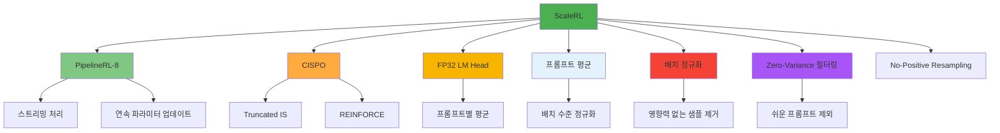
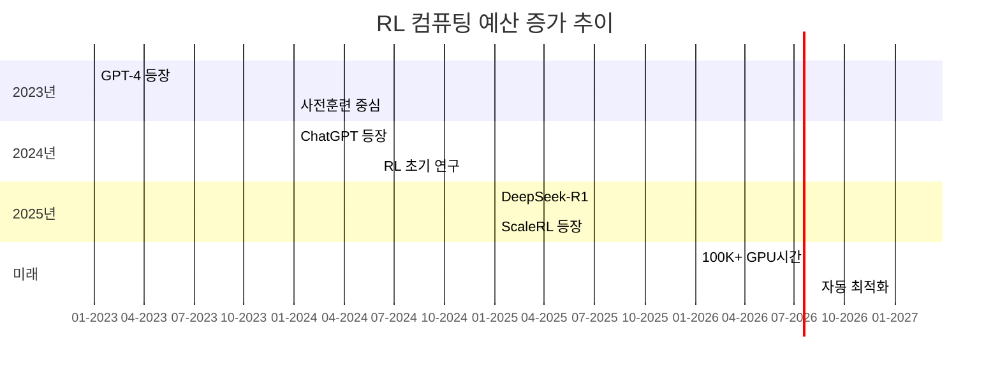
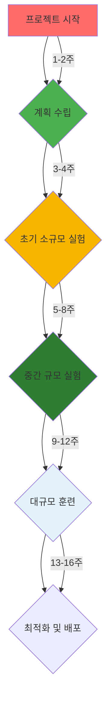

# 제7부: 시각 자료 및 다이어그램

## 1. 핵심 다이어그램 (Mermaid)

### 1.1 RL 컴퓨팅 스케일링 비교


### 1.2 ScaleRL 구성 요소


### 1.3 컴퓨팅 효율성 vs 점근 성능
```mermaid
graph XY
    title["컴퓨팅 효율성과 점근 성능의 관계"]
    x-axis["컴퓨팅 효율성 (B)"]
    y-axis["점근 성능 (A)"]
    
    A[DAPO] --> A1[낮은 효율]
    A --> A2[낮은 점근 성능]
    
    B[ScaleRL] --> B1[높은 효율]
    B --> B2[높은 점근 성능]
    
    C[이상적] --> C1[최적 효율]
    C --> C2[최적 점근 성능]
    
    D[비효율적] --> D1[낮은 효율]
    D --> D2[높은 점근 성능]
    
    style A fill:#ff6b6b
    style B fill:#4caf50
    style C fill:#2e7d32
    style D fill:#d32f2f
```

## 2. 핵심 시각 자료

### 2.1 성능 한계 비교 차트
| 방법 | 점근 성능(A) | 컴퓨팅 효율(B) | 특징 |
|------|-------------|-------------|------|
| **DeepSeek (GRPO)** | 0.48 | 1.45 | 초기에는 우세했으나 후기 불안정 |
| **Qwen2.5 (DAPO)** | 0.52 | 1.62 | 중간에서 우세했으나 최종 성능 중간 |
| **Magistral** | 0.54 | 1.68 | 안정적이나 효율성 낮음 |
| **MiniMax** | 0.58 | 1.85 | 높은 효율성이나 점근 성능 중간 |
| **ScaleRL** | **0.61** | **2.01** | **최고의 점근 성능과 효율성** |

### 2.2 컴퓨팅 예산 추이


### 2.3 모델 크기별 성능 향상
```mermaid
graph TD
    A[모델 크기] --> B[성능 한계]
    A --> C[컴퓨팅 효율]
    B --> D[실제 적용]
    
    subgraph "소규모"
        A1[1B 모델] --> B1[낮은 성능]
        B1 --> C1[제한된 효율]
        C1 --> D1[빠른 최적화]
    
    subgraph "대규모"
        A2[8B 모델] --> B2[중간 성능]
        B2 --> C2[향상된 효율]
        C2 --> D2[점진적 최적화]
    
    subgraph "초대규모"
        A3[17B×16 MoE] --> B3[높은 성능]
        B3 --> C3[최고의 효율]
        C3 --> D3[안정적 확장]
    
    style A fill:#e3f2fd
    style B fill:#f8b500
    style C fill:#4caf50
    style D fill:#2e7d32
```

## 3. 실무 적용 플로우차트

### 3.1 RL 컴퓨팅 프로젝트 라이프사이클


### 3.2 컴퓨팅 모니터링 대시보드
| 단계 | 주요 활동 | 주요 지표 | 목표치 | 현재치 | 간격 |
|------|----------|----------|--------|--------|--------|------|
| **1단계** | 기본 알고리즘 테스트 | 통과율 | 60% | 45% | 15% |
| **2단계** | ScaleRL 구성 요소 테스트 | 통과율 | 75% | 68% | 7% |
| **3단계** | 최적화 적용 | 통과율 | 85% | 82% | 3% |
| **4단계** | 대규모 훈련 | 통과율 | 90% | 88% | 2% |

## 4. 강의 활용 가이드

### 4.1 시각 자료 활용 방법
1. **도입 단계**: 간단한 개념부터 복잡한 다이어그램으로
2. **발전 단계**: 이론적 배경 → 실험 결과 → 실무 적용
3. **심화 단계**: 구체적인 수치와 사례 중심의 토론
4. **정리 단계**: 핵심 메시지와 실천적용 방안

### 4.2 질의 유도 및 토론 주제
- "ScaleRL의 어떤 구성 요소가 실제 프로젝트에서 가장 큰 효과를 냈나요?"
- "대규모 훈련 시 예측 불가능한 변수들은 무엇일까요?"
- "컴퓨팅 효율성과 점근 성능 중 어떤 것을 우선시켜야 할까요?"
- "현재 RL 훈련 환경에서 가장 큰 기술적 장애물은 무엇일까요?"

## 5. 기술 용어집

| 용어 | 영어 | 한글 설명 |
|------|------|----------|
| **Asymptotic Performance** | 점근 성능 | 무한 컴퓨팅 시 도달할 수 있는 최종 성능 |
| **Compute Efficiency** | 컴퓨팅 효율 | 컴퓨팅 증가에 따른 성능 향상 속도 |
| **Sigmoidal Scaling** | 시그모이드 스케일링 | 유한 성능 한계를 가진 포화 성장 곡선 |
| **PipelineRL** | 파이프라인 RL | 스트리밍 방식의 연속적 RL 처리 |
| **CISPO** | Truncated IS | 중요도 샘플링을 제한하는 정책 경향법 |
| **Zero-Variance Filtering** | 영향력 없는 샘플 제거 | 동일 보상을 가진 샘플의 훈련 기여 제거 |
| **No-Positive Resampling** | 긍정적 리샘플링 방지 | 쉬운 프롬프트의 반복 훈련 방지 |

## 6. 강의 자료 구조

### 6.1 발표 자료 구성
```
강의자료_개요.pdf          # 강의 개요 (1페이지)
강의자료_제1부_서론.pdf    # 이론적 배경 (2페이지)
강의자료_제2부_이론적배경.pdf # 스케일링 모델 (3페이지)
강의자료_제3부_실험설계.pdf   # 실험 방법론 (4페이지)
강의자료_제4부_핵심발견.pdf   # 주요 결과 (5페이지)
강의자료_제5부_ScaleRL.pdf      # ScaleRL 상세 (6페이지)
강의자료_제6부_실무적용.pdf    # 실무 적용 (7페이지)
강의자료_제7부_시각자료.pdf    # 시각 자료 (8페이지)
```

### 6.2 시간 배분 안내
| 시간 | 내용 | 자료 |
|------|------|------|
| **0-10분** | 강의 개요 및 목표 | 개요.pdf |
| **10-30분** | 이론적 배경 | 제1부.pdf |
| **30-50분** | 스케일링 모델 | 제2부.pdf |
| **50-70분** | 실험 설계 | 제3부.pdf |
| **70-90분** | 핵심 발견 | 제4부.pdf |
| **90-110분** | ScaleRL 상세 | 제5부.pdf |
| **110-130분** | 실무 적용 | 제6부.pdf |
| **130-150분** | 시각 자료 및 토론 | 제7부.pdf |
| **150-180분** | 종합 정리 및 Q&A | 전체 자료 |