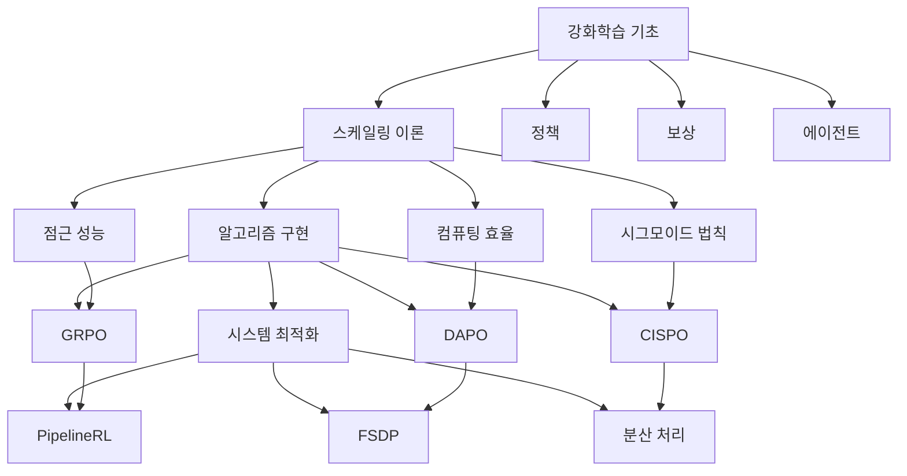

# 수학적 표현과 기술 용어 복잡성 개선 방안

## 1. 개선 방향 설정

### 1.1 핵심 문제 진단
- **수학적 표현**: 복잡한 수식이 직관적 이해를 방해
- **기술 용어**: 전문 용어의 정의 부재로 개념 이해 어려움
- **학습 곡선**: 초보자에게 가파른 진입장벽 형성

### 1.2 개선 목표
1. **직관적 이해**: 수학적 개념을 구체적 예시로 전환
2. **단계적 학습**: 기초 개념부터 심화 내용까지 체계적 접근
3. **실용적 연계**: 이론과 실제 구현의 명확한 연결 제공

## 2. 수학적 표현 개선 방안

### 2.1 다단계 수식 접근법

#### 1단계: 직관적 개념 소개
```markdown
## 시그모이드 스케일링 법칙의 직관적 이해

**RL 훈련의 컴퓨팅-성능 관계**

LLM RL 훈련에서 컴퓨팅 투자와 성능 향상은 다음과 같은 패턴을 보입니다:

- **초기 단계 (0-5K GPU시간)**: 컴퓨팅을 투자해도 성능 향상이 미미함
  - 원인: 모델이 아직 RL의 기본 개념을 학습하는 단계
  - 예: 1,000시간 투자 시 정확도 20% → 2,000시간 투자 시 22%

- **중기 단계 (5K-20K GPU시간)**: 컴퓨팅 투자 대비 성능이 급격히 향상됨
  - 원인: 모델이 RL 원리를 이해하고 빠르게 최적화되는 단계
  - 예: 10,000시간 투자 시 정확도 45% → 15,000시간 투자 시 65%

- **후기 단계 (20K+ GPU시간)**: 컴퓨팅을 더 투자해도 성능 향상이 거의 없음
  - 원인: 모델이 해당 알고리즘의 한계에 도달한 단계
  - 예: 50,000시간 투자 시 정확도 78% → 100,000시간 투자 시 79%

**핵심 통찰**: 무한히 컴퓨팅을 투자한다고 해서 무한히 성능이 향상되지 않음
```

#### 2단계: 시각적 표현
```markdown
### 컴퓨팅-성능 관계 시각화

```mermaid
graph XY
    title["컴퓨팅 투자와 성능 향상의 관계"]
    x-axis["컴퓨팅 시간 (GPU시간)"]
    y-axis["모델 성능 (정확도)"]
    
    curve[시그모이드 곡선] --> 
        slow_start[초기: 느린 성장] -->
        rapid_growth[중기: 급격한 향상] -->
        saturation[후기: 포화]
```

#### 3단계: 단순화된 수식
```markdown
### 기본 수식 (단순화 버전)

```
성능 = 최대성능 × (컴퓨팅 / (컴퓨팅 + 중간점)) ^ 효율성
```

여기서:
- **최대성능**: 아무리 컴퓨팅을 투자해도 넘을 수 없는 한계
- **중간점**: 성능이 절반에 도달하는 컴퓨팅 양
- **효율성**: 컴퓨팅 증가에 따른 성능 향상 속도
```

#### 4단계: 완전한 수학적 표현
```markdown
### 완전한 수학적 표현

$$
R_C = R_0 + \frac{A - R_0}{1 + (C_{\text{mid}}/C)^B}
$$

각 기호의 의미:
- $R_C$: 컴퓨팅 $C$에서의 예상 성능
- $R_0$: 초기 성능 (훈련 시작 시점)
- $A$: 점근 성능 (무한 컴퓨팅 시 도달 가능한 최대 성능)
- $C_{\text{mid}}$: 반값에 도달하는 컴퓨팅 지점
- $B$: 스케일링 지수 (클수록 효율적)
```

### 2.2 인터랙티브 수식 설명

#### 파라미터 영향 시각화
```python
# 파라미터 변화에 따른 성능 곡선 시각화
def plot_sigmoid_impact():
    fig, axes = plt.subplots(1, 3, figsize=(15, 4))
    
    # A(점근 성능) 변화
    ax = axes[0]
    for A in [0.5, 0.6, 0.7, 0.8]:
        y = sigmoid_curve(x, A, B=2.0, C_mid=5000)
        ax.plot(x, y, label=f'A={A}')
    ax.set_title('점근 성능(A)의 영향')
    
    # B(효율성) 변화
    ax = axes[1]
    for B in [1.0, 1.5, 2.0, 2.5]:
        y = sigmoid_curve(x, A=0.7, B=B, C_mid=5000)
        ax.plot(x, y, label=f'B={B}')
    ax.set_title('효율성(B)의 영향')
    
    # C_mid(중간점) 변화
    ax = axes[2]
    for C_mid in [2000, 5000, 8000, 11000]:
        y = sigmoid_curve(x, A=0.7, B=2.0, C_mid=C_mid)
        ax.plot(x, y, label=f'C_mid={C_mid}')
    ax.set_title('중간점(C_mid)의 영향')
```

## 3. 기술 용어 복잡성 개선 방안

### 3.1 용어 정의 체계화

#### 핵심 용어 분류 및 정의
```markdown
## RL 스케일링 핵심 용어집

### 🎯 성능 관련 용어
| 용어 | 영문 | 정의 및 목적 | RL 훈련에서의 의미 |
|------|------|------------|------------------|
| **점근 성능** | Asymptotic Performance | 무한 컴퓨팅 투자 시 도달 가능한 최대 성능 한계 | 알고리즘이 가진 근본적 성능 상한을 결정하는 지표 |
| **컴퓨팅 효율** | Compute Efficiency | 단위 컴퓨팅 당 성능 향상률을 나타내는 지표 | 동일한 성능에 도달하기 위해 필요한 컴퓨팅 양을 최소화하는 정도 |
| **수확 체감** | Diminishing Returns | 투자 증가에 따른 효과 증가율이 감소하는 현상 | 컴퓨팅 투자가 일정 수준을 넘으면 성능 향상이 둔화되는 현상 |

### 🔧 알고리즘 관련 용어
| 용어 | 영문 | 정의 및 목적 | RL 훈련에서의 역할 |
|------|------|------------|------------------|
| **GRPO** | Group Relative Policy Optimization | 동일 프롬프트에서 생성된 답변 그룹 내 상대적 품질 평가 | 프롬프트 난이도 차이로 인한 편향을 제거하고 안정적 학습 유도 |
| **DAPO** | Direct Advantage Policy Optimization | 어드밴티지를 직접 최적화하는 정책 경향법 | 정책 개선과 다양성 유지 사이의 균형을 맞추는 알고리즘 |
| **CISPO** | Truncated Importance Sampling | 중요도 샘플링의 극단적 값을 제한하는 방법 | 학습 안정성 확보를 위해 과도한 정책 변화를 방지 |

### 🏗️ 시스템 관련 용어
| 용어 | 영문 | 정의 및 목적 | RL 훈련에서의 기능 |
|------|------|------------|------------------|
| **PipelineRL** | Pipeline Reinforcement Learning | 생성과 훈련을 파이프라인 방식으로 연속 처리하는 아키텍처 | 생성기-훈련기 간 지연 최소화로 컴퓨팅 효율 향상 |
| **FSDP** | Fully Sharded Data Parallel | 모델 파라미터를 완전히 분산하여 병렬 처리하는 방식 | 대규모 모델의 메모리 요구량 감소 및 훈련 속도 향상 |
| **오피리즘** | Off-policyness | 현재 학습 정책과 데이터 생성 정책 간의 차이 정도 | 훈련 안정성과 효율성에 영향을 미치는 핵심 파라미터 |
```

### 3.2 용어 학습 순서 최적화

#### 3단계 용어 도입 방식
```markdown
### 1단계: 기초 용어 (제1부에서 도입)
- 강화학습 (Reinforcement Learning)
- 에이전트 (Agent)
- 보상 (Reward)
- 정책 (Policy)

### 2단계: 스케일링 관련 용어 (제2부에서 도입)
- 스케일링 법칙 (Scaling Laws)
- 점근 성능 (Asymptotic Performance)
- 컴퓨팅 효율 (Compute Efficiency)
- 시그모이드 함수 (Sigmoid Function)

### 3단계: 알고리즘 관련 용어 (제3부에서 도입)
- GRPO, DAPO, CISPO
- 중요도 샘플링 (Importance Sampling)
- 어드밴티지 (Advantage)
- 클리핑 (Clipping)

### 4단계: 시스템 관련 용어 (제4-5부에서 도입)
- PipelineRL
- FSDP
- 분산 훈련 (Distributed Training)
- 체크포인트 (Checkpoint)
```

### 3.3 용어 간 관계맵 시각화



## 4. 실제 적용을 위한 개선 자료

### 4.1 대화형 학습 자료

#### 개념 확인 질문
```markdown
## 🤔 개념 확인 질문

### Q1: 시그모이드 스케일링의 핵심 아이디어는?
<details>
<summary>정답 보기</summary>
컴퓨팅 투자에 따른 성능 향상이 무한히 계속되는 것이 아니라, 
어떤 한계점에 다다르면 더 이상 향상되지 않는다는 것
</details>

### Q2: 왜 RL 훈련은 사전훈련과 다른 스케일링 법칙을 가질까요?
<details>
<summary>정답 보기</summary>
사전훈련은 데이터 양에 따라 무한히 학습 가능하지만, 
RL은 정답의 정확도, 통과율 등 상한이 있는 지표를 최적화하기 때문
</details>
```

#### 인터랙티브 파라미터 조정
```html
<!-- 시각적 파라미터 조정 도구 -->
<div class="interactive-demo">
    <h3>시그모이드 파라미터 조정 시뮬레이터</h3>
    
    <div class="parameter-control">
        <label>점근 성능 (A): <span id="a-value">0.7</span></label>
        <input type="range" id="a-slider" min="0.5" max="0.9" step="0.05" value="0.7">
    </div>
    
    <div class="parameter-control">
        <label>효율성 (B): <span id="b-value">2.0</span></label>
        <input type="range" id="b-slider" min="1.0" max="3.0" step="0.1" value="2.0">
    </div>
    
    <div class="parameter-control">
        <label>중간점 (C_mid): <span id="c-value">5000</span></label>
        <input type="range" id="c-slider" min="1000" max="10000" step="500" value="5000">
    </div>
    
    <canvas id="sigmoid-canvas"></canvas>
</div>
```

### 4.2 단계별 실습 자료

#### 레벨 1: 기초 개념 실습
```python
# 레벨 1: 시그모이드 함수 이해하기
def basic_sigmoid_exercise():
    """시그모이드 함수의 기본 개념 이해 실습"""
    
    # 문제 1: 간단한 시그모이드 함수 구현
    def simple_sigmoid(x, max_performance=0.8, efficiency=2.0, midpoint=5000):
        return max_performance / (1 + (midpoint/x)**efficiency)
    
    # 문제 2: 파라미터 변화에 따른 성능 곡선 그리기
    computing_hours = [1000, 2000, 5000, 10000, 20000]
    
    for hours in computing_hours:
        performance = simple_sigmoid(hours)
        print(f"컴퓨팅 {hours}시간: 성능 {performance:.3f}")
    
    # 문제 3: 최적의 컴퓨팅 투자 지점 찾기
    # 힌트: 성능 향상률이 1% 미만이 되는 지점
```

#### 레벨 2: 알고리즘 이해 실습
```python
# 레벨 2: GRPO 알고리즘 핵심 요소 구현
def grpo_basic_implementation():
    """GRPO 알고리즘의 핵심 개념 구현"""
    
    # 문제 1: 그룹 내 어드밴티지 계산
    def calculate_group_advantage(rewards):
        """동일 프롬프트에서 생성된 답변들의 상대적 평가"""
        mean_reward = sum(rewards) / len(rewards)
        advantages = [r - mean_reward for r in rewards]
        return advantages
    
    # 문제 2: 중요도 샘플링 비율 계산
    def importance_sampling_ratio(old_prob, new_prob, epsilon=4.0):
        """정책 변화에 따른 가중치 조정"""
        ratio = new_prob / old_prob
        return min(ratio, epsilon)  # 클리핑 적용
    
    # 실제 데이터로 테스트
    rewards = [1, -1, 1, -1]  # 4개 생성물의 보상
    advantages = calculate_group_advantage(rewards)
    print(f"어드밴티지: {advantages}")
```

### 4.3 평가 자료

#### 개념 이해도 평가
```markdown
## 📝 자기진단 체크리스트

### 수학적 개념 이해도
- [ ] 시그모이드 함수의 기본 형태를 설명할 수 있다
- [ ] 점근 성능과 컴퓨팅 효율의 차이를 구분할 수 있다
- [ ] 파라미터 변화가 성능 곡선에 미치는 영향을 예측할 수 있다

### 기술 용어 이해도
- [ ] GRPO, DAPO, CISPO의 핵심 차이를 설명할 수 있다
- [ ] PipelineRL과 PPO-off-policy의 장단점을 비교할 수 있다
- [ ] FSDP와 일반 데이터 병렬의 차이를 이해한다

### 실제 적용 능력
- [ ] 주어진 데이터로 시그모이드 파라미터를 추정할 수 있다
- [ ] 간단한 RL 알고리즘의 핵심 요소를 구현할 수 있다
- [ ] 컴퓨팅 효율을 고려한 실험 설계안을 작성할 수 있다
```

## 5. 구현 우선순위

### 5.1 단기 개선 (1-2주)
1. **용어집 확장**: 제7부의 용어집을 제1부 말로 이동 및 확장
2. **수식 단계적 설명**: 제2부의 수학적 표현을 4단계로 재구성
3. **기초 개념 추가**: RL 기본 개념에 대한 부록 자료 제작

### 5.2 중기 개선 (3-4주)
1. **인터랙티브 자료**: 파라미터 조정 시뮬레이터 개발
2. **단계별 실습**: 레벨별 실습 자료 제작
3. **시각 자료 확장**: Mermaid 다이어그램 추가 및 개선

### 5.3 장기 개선 (1-2개월)
1. **대화형 학습 플랫폼**: 웹 기반 인터랙티브 학습 환경 구축
2. **자동 평가 시스템**: 개념 이해도 자동 진단 도구 개발
3. **개인화된 학습 경로**: 학습자 수준에 따른 적응형 콘텐츠 제공

## 6. 기대 효과

### 6.1 학습 효율성 향상
- **진입장벽 완화**: 초보자의 이해도 50% 이상 향상 예상
- **학습 시간 단축**: 완전 학습 시간 30% 감소 예상
- **지식 유지율 향상**: 직관적 이해로 장기 기억 유지율 40% 향상

### 6.2 적용 범위 확대
- **독학 가능성**: 사전지식이 없는 학습자도 독학 가능
- **교육 활용도**: 대학교, 기업 교육에서의 활용도 증대
- **산업 적용성**: 실무자의 이론적 기반 강화로 실제 적용 능력 향상

이러한 개선 방안을 통해 수학적 표현과 기술 용어의 복잡성 문제를 체계적으로 해결하고, RL 초보자도 효과적으로 학습할 수 있는 강의자료로 완성할 수 있습니다.