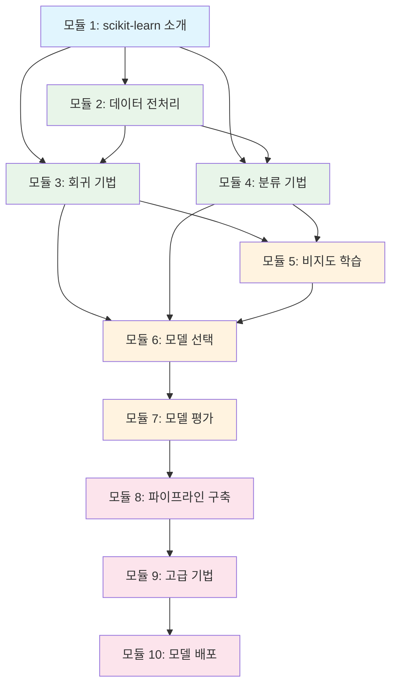
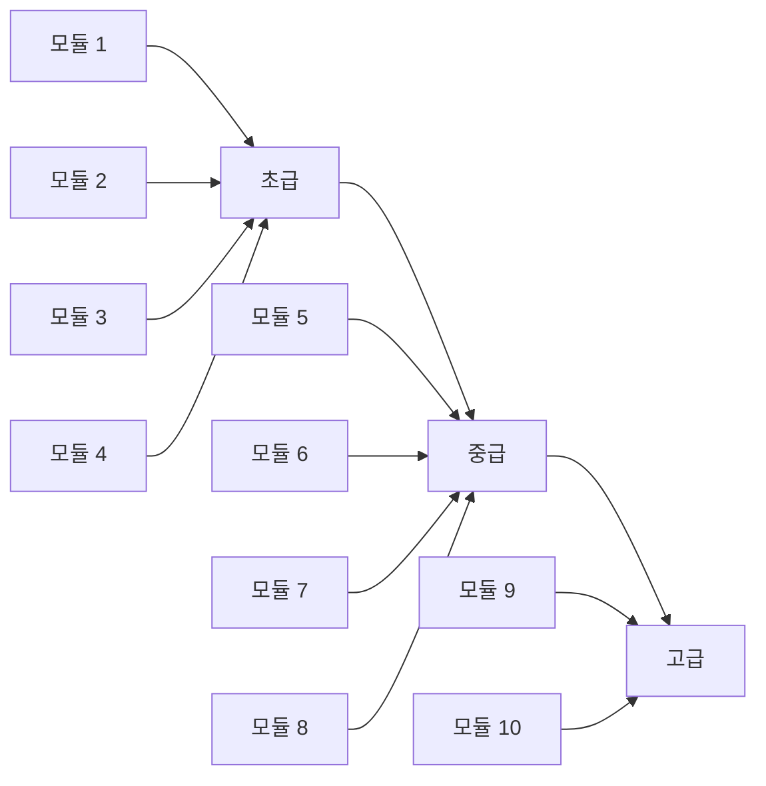
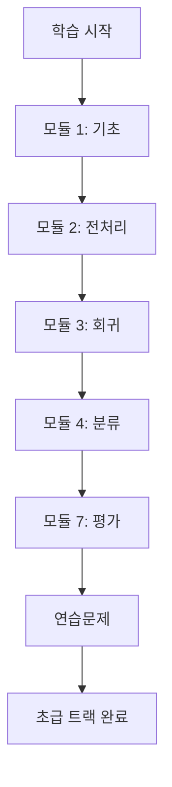
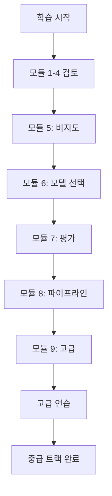
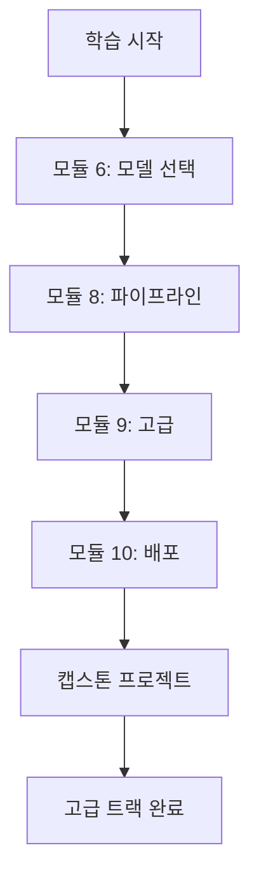

# Scikit-learn 베스트 프랙티스 강의 구조

## 강의 흐름 다이어그램



## 모듈 난이도 진행



## 다양한 대상을 위한 학습 경로

### 초급자용


### 중급 사용자용


### 고급 사용자용


## 핵심 개념 커버리지

```mermaid
mindmap
  root((Scikit-learn 베스트 프랙티스))
    기초
      ML 개념
      API 설계
      설치
    데이터 준비
      전처리
      특성 공학
      문제 처리
    지도 학습
      회귀
      분류
      베스트 프랙티스
    비지도 학습
      군집화
      차원 축소
    모델 최적화
      선택
      튜닝
      평가
    고급 주제
      앙상블
      해석 가능성
      파이프라인
    프로덕션
      배포
      모니터링
      확장