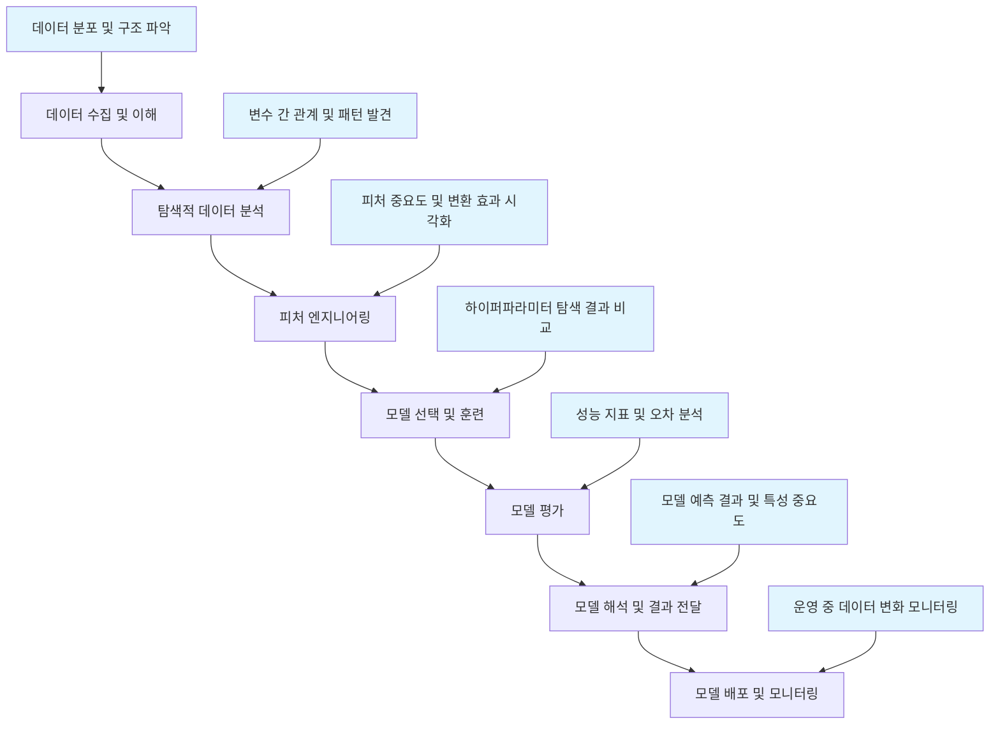

# Seaborn 머신러닝 문제 해결 가이드


이 저장소는 머신러닝 프로젝트에서 Seaborn을 활용하여 실제 문제를 해결하는 방법을 다룹니다. 데이터 탐색부터 모델 평가, 운영 모니터링까지 머신러닝 워크플로우 전반에 걸쳐 Seaborn을 효과적으로 활용하는 실용적인 예제와 패턴을 제공합니다.

## 📚 목차

### 핵심 문서
- [Seaborn 소개](docs/01-introduction.md) - 머신러닝에서의 Seaborn 활용 소개
- [설치 및 설정](docs/02-installation.md) - Seaborn 설치와 머신러닝 환경 설정
- [머신러닝 문제 해결 프레임워크](docs/ml-problem-solution-framework.md) - ML 워크플로우별 Seaborn 활용 패턴

### 실용적인 플롯 가이드
- [문제 해결 중심 기본 플롯](docs/03-basic-plots-problem-solution.md) - ML 문제 해결을 위한 기본 플롯 활용
- [고급 플롯 유형](docs/04-advanced-plots.md) - 복잡한 데이터 시각화 기법
- [스타일링](docs/05-styling.md) - 효과적인 정보 전달을 위한 스타일링
- [색상 팔레트](docs/06-colors.md) - ML 문제 유형별 색상 팔레트 선택
- [플롯 구성](docs/07-composition.md) - 다중 플롯으로 복잡한 정보 전달

### 실전 문제 해결
- [머신러닝 실전 문제 해결 예시](docs/ml-practical-examples.md) - 실제 ML 문제 해결 사례
- [실용적인 문제 해결 가이드](docs/10-troubleshooting-practical.md) - ML 프로젝트에서의 문제 해결
- [다른 라이브러리와 통합](docs/08-integration.md) - Scikit-learn, Pandas 등과의 통합
- [성능 최적화](docs/09-performance.md) - 대용량 데이터 처리 및 성능 향상

### 참조 자료
- [참조 요약 및 치트 시트](docs/12-reference.md) - ML 문제 해결을 위한 빠른 참조
- [기존 예시](docs/11-examples.md) - 일반적인 Seaborn 사용 예시

## 머신러닝 프로젝트에서의 Seaborn 활용

이 가이드는 머신러닝 프로젝트의 전체 수명주기에 걸쳐 Seaborn을 활용하는 방법을 다룹니다:



## 🚀 빠른 시작

```python
import seaborn as sns
import matplotlib.pyplot as plt
from sklearn.datasets import make_classification

# 머신러닝 예제 데이터 생성
X, y = make_classification(n_samples=500, n_features=2, n_redundant=0,
                          n_informative=2, n_clusters_per_class=1, random_state=42)

# 데이터프레임 생성
df = pd.DataFrame(X, columns=['feature_1', 'feature_2'])
df['target'] = y

# 클래스별 피처 관계 시각화
sns.scatterplot(data=df, x='feature_1', y='feature_2', hue='target')
plt.title('클래스 분리 패턴 탐색')
plt.show()
```

## 📁 프로젝트 구조

```
seaborn-ml-problem-solving/
├── README.md                    # 메인 개요 및 탐색
├── requirements.txt             # 필요한 패키지 목록
├── docs/                        # 문서 디렉토리
│   ├── ml-problem-solution-framework.md  # ML 문제 해결 프레임워크
│   ├── ml-practical-examples.md          # 실전 문제 해결 예시
│   ├── 03-basic-plots-problem-solution.md # 문제 해결 중심 플롯
│   └── 10-troubleshooting-practical.md    # 실용적 문제 해결 가이드
├── data/                        # 샘플 데이터
├── examples/                    # 예제 코드
└── notebooks/                   # Jupyter 노트북 튜토리얼
```

## 🎯 학습 목표

이 가이드를 통해 다음을 배울 수 있습니다:

- 머신러닝 워크플로우별 Seaborn 활용 패턴
- 실제 ML 문제 해결을 위한 시각화 기법
- 데이터 탐색, 모델 평가, 결과 해석을 위한 시각화
- 대용량 데이터와 고차원 데이터 시각화
- 모델 성능 모니터링을 위한 시각화

## 📖 사용 방법

1. [머신러닝 문제 해결 프레임워크](docs/ml-problem-solution-framework.md)를 통해 전체적인 접근 방식을 이해하세요.
2. [문제 해결 중심 기본 플롯](docs/03-basic-plots-problem-solution.md)으로 구체적인 시각화 기법을 학습하세요.
3. [머신러닝 실전 문제 해결 예시](docs/ml-practical-examples.md)를 통해 실제 사례를 살펴보세요.
4. [실용적인 문제 해결 가이드](docs/10-troubleshooting-practical.md)로 프로젝트 문제를 해결하세요.

## 🛠️ 요구사항

- Python 3.7+
- pandas 1.0+
- matplotlib 3.0+
- seaborn 0.11+
- scikit-learn 0.24+ (머신러닝 예제)

전체 요구사항은 [requirements.txt](requirements.txt)를 확인하세요.

## 🌟 주요 특징

- **문제 해결 중심**: 이론적 설명보다 실제 문제 해결에 초점
- **머신러닝 워크플로우**: 데이터 준비부터 모델 운영까지 전 과정覆盖
- **실용적인 예시**: 실제 비즈니스 문제를 기반으로 한 구체적인 사례
- **재사용 가능한 코드**: 바로 적용할 수 있는 함수와 템플릿 제공

## 📖 예제 코드 실행

이 저장소의 예제 코드를 실행하려면 다음 단계를 따르세요:

```bash
# 저장소 클론
git clone https://github.com/your-username/seaborn-ml-problem-solving.git
cd seaborn-ml-problem-solving

# 가상 환경 생성 (권장)
python -m venv venv
source venv/bin/activate  # Windows: venv\Scripts\activate

# 종속성 설치
pip install -r requirements.txt

# 데이터 생성
python data/generate_data.py

# 예제 실행
python examples/basic_plots.py
```

## 🤝 기여

이 프로젝트는 개선을 위한 제안과 기여를 환영합니다. Issue를 생성하거나 Pull Request를 제출해주세요.

## 📄 라이선스

이 프로젝트는 MIT 라이선스 하에 배포됩니다.

## 🔗 추가 자료

### 공식 문서
- [Seaborn 공식 문서](https://seaborn.pydata.org/)
- [Scikit-learn 문서](https://scikit-learn.org/stable/)
- [Matplotlib 공식 문서](https://matplotlib.org/)
- [pandas 공식 문서](https://pandas.pydata.org/)

### 모델 해석 및 설명 가능한 AI
- [SHAP 라이브러리 문서](https://shap.readthedocs.io/)
- [Interpretable ML Book](https://christophm.github.io/interpretable-ml-book/)

### 머신러닝 운영 (MLOps)
- [MLOps.org](https://ml-ops.org/)
- [MLflow 문서](https://mlflow.org/docs/latest/index.html)