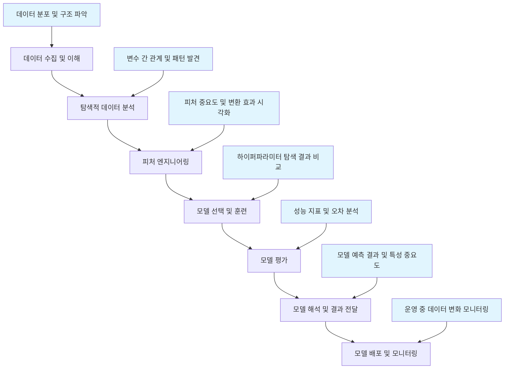

# 머신러닝 문제 해결을 위한 Seaborn 활용 프레임워크

이 문서는 머신러닝 프로젝트에서 발생하는 다양한 문제들을 Seaborn을 통해 해결하는 체계적인 접근 방식을 제시합니다.

## 머신러닝 워크플로우와 Seaborn 활용 포인트



## 1. 데이터 수집 및 이해 단계

### 문제: 데이터의 기본 구조와 품질 파악
- **상황**: 새로운 데이터셋을 받았을 때 데이터의 특성을 빠르게 파악해야 함
- **Seaborn 해결책**: 다양한 시각화를 통해 데이터 분포, 결측치, 이상치 파악

### 예시 시나리오: 신용카드 사기 탐지 데이터 분석

```python
import seaborn as sns
import matplotlib.pyplot as plt
import pandas as pd
import numpy as np

# 문제 상황: 신용카드 거래 데이터셋을 받아 사기 거래 패턴을 파악해야 함
# 해결 목표: 데이터의 기본 구조, 변수 분포, 사기 거래 특성 파악

# 데이터 로드 (가상 데이터)
def generate_fraud_data():
    np.random.seed(42)
    n_samples = 10000
    
    data = {
        'transaction_amount': np.concatenate([
            np.random.lognormal(3, 1, int(n_samples * 0.98)),  # 정상 거래
            np.random.lognormal(5, 1.5, int(n_samples * 0.02))  # 사기 거래
        ]),
        'transaction_hour': np.random.randint(0, 24, n_samples),
        'age_group': np.random.choice(['20대', '30대', '40대', '50대 이상'], n_samples),
        'is_fraud': np.concatenate([
            np.zeros(int(n_samples * 0.98)),  # 정상 거래
            np.ones(int(n_samples * 0.02))    # 사기 거래
        ])
    }
    
    # 사기 거래 특성 추가
    fraud_indices = np.where(data['is_fraud'] == 1)[0]
    data['transaction_hour'][fraud_indices] = np.random.choice([2, 3, 4, 22, 23], len(fraud_indices))
    
    return pd.DataFrame(data)

fraud_data = generate_fraud_data()

# Seaborn을 통한 데이터 탐색
fig, axes = plt.subplots(2, 2, figsize=(15, 12))

# 1. 거래 금액 분포 (전체 vs 사기 거래)
sns.histplot(data=fraud_data, x='transaction_amount', hue='is_fraud', 
             log_scale=True, kde=True, ax=axes[0, 0])
axes[0, 0].set_title('거래 금액 분포 (정상 vs 사기 거래)')

# 2. 시간대별 사기 거래 비율
hourly_fraud = fraud_data.groupby('transaction_hour')['is_fraud'].mean().reset_index()
sns.lineplot(data=hourly_fraud, x='transaction_hour', y='is_fraud', 
             marker='o', ax=axes[0, 1])
axes[0, 1].set_title('시간대별 사기 거래 비율')
axes[0, 1].set_ylabel('사기 거래 비율')

# 3. 연령대별 거래 금액 분포
sns.boxplot(data=fraud_data, x='age_group', y='transaction_amount', 
            hue='is_fraud', ax=axes[1, 0])
axes[1, 0].set_title('연령대별 거래 금액 분포')
axes[1, 0].set_yscale('log')

# 4. 거래 금액과 시간대의 관계 (사기 거래 강조)
normal_data = fraud_data[fraud_data['is_fraud'] == 0]
fraud_only = fraud_data[fraud_data['is_fraud'] == 1]

sns.scatterplot(data=normal_data, x='transaction_hour', y='transaction_amount', 
                alpha=0.3, label='정상 거래', ax=axes[1, 1])
sns.scatterplot(data=fraud_only, x='transaction_hour', y='transaction_amount', 
                color='red', label='사기 거래', ax=axes[1, 1])
axes[1, 1].set_title('시간대별 거래 금액 분포')
axes[1, 1].set_yscale('log')
axes[1, 1].legend()

plt.tight_layout()
plt.show()

# 인사이트 도출
print("데이터 탐색 결과:")
print(f"- 전체 거래 중 사기 거래 비율: {fraud_data['is_fraud'].mean():.2%}")
print(f"- 사기 거래 평균 금액: {fraud_only['transaction_amount'].mean():.2f}")
print(f"- 정상 거래 평균 금액: {normal_data['transaction_amount'].mean():.2f}")
print(f"- 사기 거래가 가장 많은 시간대: {hourly_fraud.loc[hourly_fraud['is_fraud'].idxmax(), 'transaction_hour']}시")
```

## 2. 탐색적 데이터 분석(EDA) 단계

### 문제: 변수 간의 관계와 패턴 발견
- **상황**: 머신러닝 모델링 전 중요 변수와 패턴을 파악해야 함
- **Seaborn 해결책**: 상관관계, 분포 차이, 다변량 관계 시각화

### 예시 시나리오: 주택 가격 예측을 위한 변수 탐색

```python
# 문제 상황: 주택 가격 예측 모델링 전 중요 특성 파악
# 해결 목표: 가격에 영향을 미치는 핵심 변수와 그 관계 파악

# 주택 데이터 생성
def generate_housing_data():
    np.random.seed(42)
    n_samples = 1000
    
    data = {
        'price': np.random.normal(500000, 150000, n_samples),
        'square_feet': np.random.normal(2000, 500, n_samples),
        'bedrooms': np.random.randint(1, 6, n_samples),
        'bathrooms': np.random.randint(1, 4, n_samples),
        'age': np.random.randint(0, 50, n_samples),
        'neighborhood': np.random.choice(['A', 'B', 'C', 'D'], n_samples),
        'has_garage': np.random.choice([0, 1], n_samples, p=[0.3, 0.7])
    }
    
    df = pd.DataFrame(data)
    
    # 가격과 다른 변수 간의 관계 생성
    df['price'] += df['square_feet'] * 100 + df['bedrooms'] * 20000 + df['bathrooms'] * 15000
    df['price'] -= df['age'] * 1000
    df['price'] += df['has_garage'] * 30000
    
    # 이웃별 가격 차이
    neighborhood_premium = {'A': 50000, 'B': 30000, 'C': 0, 'D': -20000}
    df['price'] += df['neighborhood'].map(neighborhood_premium)
    
    # 노이즈 추가
    df['price'] += np.random.normal(0, 25000, n_samples)
    
    return df

housing_data = generate_housing_data()

# Seaborn을 통한 EDA
fig, axes = plt.subplots(2, 3, figsize=(18, 12))

# 1. 가격 분포
sns.histplot(data=housing_data, x='price', kde=True, ax=axes[0, 0])
axes[0, 0].set_title('주택 가격 분포')
axes[0, 0].set_xlabel('가격 ($)')

# 2. 면적과 가격 관계
sns.scatterplot(data=housing_data, x='square_feet', y='price', 
                hue='bedrooms', size='has_garage', ax=axes[0, 1])
axes[0, 1].set_title('면적과 가격 관계')

# 3. 이웃별 가격 분포
sns.boxplot(data=housing_data, x='neighborhood', y='price', ax=axes[0, 2])
axes[0, 2].set_title('이웃별 가격 분포')

# 4. 침실 수와 가격 관계
sns.boxplot(data=housing_data, x='bedrooms', y='price', ax=axes[1, 0])
axes[1, 0].set_title('침실 수별 가격 분포')

# 5. 주택 연령과 가격 관계
sns.regplot(data=housing_data, x='age', y='price', 
            scatter_kws={'alpha': 0.3}, ax=axes[1, 1])
axes[1, 1].set_title('주택 연령과 가격 관계')

# 6. 상관관계 히트맵
numeric_cols = ['price', 'square_feet', 'bedrooms', 'bathrooms', 'age', 'has_garage']
corr_matrix = housing_data[numeric_cols].corr()
sns.heatmap(corr_matrix, annot=True, cmap='coolwarm', center=0, ax=axes[1, 2])
axes[1, 2].set_title('변수 간 상관관계')

plt.tight_layout()
plt.show()

# 인사이트 도출
print("EDA 결과:")
print(f"- 가격과 가장 높은 상관관계: {corr_matrix['price'].drop('price').abs().idxmax()}")
print(f"- 가장 비싼 이웃: {housing_data.groupby('neighborhood')['price'].mean().idxmax()}")
print(f"- 가장 인기 있는 침실 수: {housing_data['bedrooms'].mode().iloc[0]}개")
```

## 3. 피처 엔지니어링 단계

### 문제: 피처 변환의 효과 시각화
- **상황**: 피처 엔지니어링 후 변환 효과를 확인하고 최적의 피처 선택
- **Seaborn 해결책**: 변환 전후 분포 비교, 피처 중요도 시각화

### 예시 시나리오: 고객 이탈 예측을 위한 피처 엔지니어링

```python
# 문제 상황: 고객 이탈 예측 모델을 위한 피처 엔지니어링 효과 확인
# 해결 목표: 피처 변환이 모델 성능에 미치는 영향 시각화

# 고객 데이터 생성
def generate_customer_churn_data():
    np.random.seed(42)
    n_samples = 2000
    
    data = {
        'customer_id': range(n_samples),
        'tenure_months': np.random.exponential(scale=24, size=n_samples).astype(int),
        'monthly_charges': np.random.normal(65, 30, n_samples),
        'total_charges': 0,  # 계산 필요
        'contract_type': np.random.choice(['월간', '1년', '2년'], n_samples, p=[0.5, 0.3, 0.2]),
        'payment_method': np.random.choice(['자동이체', '신용카드', '기타'], n_samples),
        'internet_service': np.random.choice(['없음', 'DSL', '광섬유'], n_samples, p=[0.2, 0.4, 0.4]),
        'tech_support': np.random.choice([0, 1], n_samples, p=[0.6, 0.4]),
        'churned': np.random.choice([0, 1], n_samples, p=[0.73, 0.27])
    }
    
    df = pd.DataFrame(data)
    
    # 총 요금 계산
    df['total_charges'] = df['tenure_months'] * df['monthly_charges']
    
    # 이탈 확률에 영향을 미치는 요인 추가
    churn_factors = {
        '월간': 1.5,
        '1년': 1.0,
        '2년': 0.5
    }
    
    for idx in df.index:
        base_prob = 0.27
        contract_factor = churn_factors[df.loc[idx, 'contract_type']]
        tenure_factor = max(0.2, 1 - (df.loc[idx, 'tenure_months'] / 60))
        tech_factor = 0.7 if df.loc[idx, 'tech_support'] == 1 else 1.3
        
        adjusted_prob = base_prob * contract_factor * tenure_factor * tech_factor
        df.loc[idx, 'churned'] = 1 if np.random.random() < adjusted_prob else 0
    
    return df

churn_data = generate_customer_churn_data()

# 피처 엔지니어링
def engineer_features(df):
    df_engineered = df.copy()
    
    # 1. 로그 변환 (왜곡된 분포 정규화)
    df_engineered['log_monthly_charges'] = np.log1p(df['monthly_charges'])
    df_engineered['log_total_charges'] = np.log1p(df['total_charges'])
    
    # 2. 범주형 변수 인코딩
    contract_rank = {'월간': 1, '1년': 2, '2년': 3}
    df_engineered['contract_rank'] = df['contract_type'].map(contract_rank)
    
    # 3. 비율 피처 생성
    df_engineered['avg_monthly_charge'] = df['total_charges'] / df['tenure_months']
    df_engineered['charge_ratio'] = df['monthly_charges'] / df['avg_monthly_charge']
    
    # 4. 이진 피처 생성
    df_engineered['is_long_term_customer'] = (df['tenure_months'] > 24).astype(int)
    df_engineered['is_high_value_customer'] = (df['monthly_charges'] > df['monthly_charges'].median()).astype(int)
    
    return df_engineered

churn_engineered = engineer_features(churn_data)

# Seaborn을 통한 피처 엔지니어링 효과 시각화
fig, axes = plt.subplots(2, 3, figsize=(18, 12))

# 1. 원래 월별 요금 분포 vs 로그 변환 후 분포
sns.histplot(data=churn_data, x='monthly_charges', kde=True, ax=axes[0, 0])
axes[0, 0].set_title('원래 월별 요금 분포')

sns.histplot(data=churn_engineered, x='log_monthly_charges', kde=True, ax=axes[0, 1])
axes[0, 1].set_title('로그 변환 후 월별 요금 분포')

# 2. 계약 유형별 이탈률 (원래 vs 순위 인코딩)
sns.countplot(data=churn_data, x='contract_type', hue='churned', ax=axes[0, 2])
axes[0, 2].set_title('계약 유형별 이탈 여부')

# 3. 신규 피처와 이탈 관계
sns.boxplot(data=churn_engineered, x='churned', y='charge_ratio', ax=axes[1, 0])
axes[1, 0].set_title('요금 비율과 이탈 관계')

# 4. 장기 고객 여부와 이탈 관계
sns.countplot(data=churn_engineered, x='is_long_term_customer', hue='churned', ax=axes[1, 1])
axes[1, 1].set_title('장기 고객 여부와 이탈 관계')

# 5. 피처 간 상관관계
feature_cols = ['tenure_months', 'monthly_charges', 'log_monthly_charges', 
               'contract_rank', 'charge_ratio', 'churned']
corr_matrix = churn_engineered[feature_cols].corr()
sns.heatmap(corr_matrix, annot=True, cmap='coolwarm', center=0, ax=axes[1, 2])
axes[1, 2].set_title('피처 간 상관관계')

plt.tight_layout()
plt.show()

# 인사이트 도출
print("피처 엔지니어링 결과:")
print(f"- 로그 변환 후 월별 요금의 왜도: {churn_engineered['log_monthly_charges'].skew():.2f} (원래: {churn_data['monthly_charges'].skew():.2f})")
print(f"- 장기 고객의 이탈률: {churn_engineered[churn_engineered['is_long_term_customer']==1]['churned'].mean():.2%}")
print(f"- 단기 고객의 이탈률: {churn_engineered[churn_engineered['is_long_term_customer']==0]['churned'].mean():.2%}")
```

## 4. 모델 선택 및 훈련 단계

### 문제: 하이퍼파라미터 탐색 결과 비교
- **상황**: 다양한 모델과 하이퍼파라미터 조합의 성능을 비교해야 함
- **Seaborn 해결책**: 모델 성능 비교 시각화, 하이퍼파라미터 영향 분석

### 예시 시나리오: 분류 모델 성능 비교

```python
from sklearn.ensemble import RandomForestClassifier
from sklearn.model_selection import cross_val_score, train_test_split
from sklearn.metrics import accuracy_score, classification_report, confusion_matrix
from sklearn.preprocessing import StandardScaler
from sklearn.linear_model import LogisticRegression
from sklearn.svm import SVC

# 문제 상황: 여러 분류 모델의 성능을 비교하고 최적 모델 선택
# 해결 목표: 다양한 모델과 하이퍼파라미터 조합의 성능을 시각화하여 비교

# 데이터 준비
X = churn_engineered.drop(['customer_id', 'churned', 'contract_type', 'payment_method'], axis=1)
y = churn_engineered['churned']

# 범주형 변수 원-핫 인코딩
X = pd.get_dummies(X, columns=['internet_service'], drop_first=True)

# 학습/테스트 분할
X_train, X_test, y_train, y_test = train_test_split(X, y, test_size=0.2, random_state=42)

# 스케일링
scaler = StandardScaler()
X_train_scaled = scaler.fit_transform(X_train)
X_test_scaled = scaler.transform(X_test)

# 다양한 모델 성능 비교
def compare_models():
    models = {
        'Logistic Regression': LogisticRegression(max_iter=1000, random_state=42),
        'Random Forest (n=10)': RandomForestClassifier(n_estimators=10, random_state=42),
        'Random Forest (n=50)': RandomForestClassifier(n_estimators=50, random_state=42),
        'Random Forest (n=100)': RandomForestClassifier(n_estimators=100, random_state=42),
        'SVM (linear)': SVC(kernel='linear', random_state=42),
        'SVM (rbf)': SVC(kernel='rbf', random_state=42)
    }
    
    results = []
    
    for name, model in models.items():
        if 'SVM' in name:
            model.fit(X_train_scaled, y_train)
            train_score = model.score(X_train_scaled, y_train)
            test_score = model.score(X_test_scaled, y_test)
            cv_scores = cross_val_score(model, X_train_scaled, y_train, cv=5)
        else:
            model.fit(X_train, y_train)
            train_score = model.score(X_train, y_train)
            test_score = model.score(X_test, y_test)
            cv_scores = cross_val_score(model, X_train, y_train, cv=5)
        
        results.append({
            'Model': name,
            'Train Accuracy': train_score,
            'Test Accuracy': test_score,
            'CV Mean': cv_scores.mean(),
            'CV Std': cv_scores.std()
        })
    
    return pd.DataFrame(results)

model_results = compare_models()

# Seaborn을 통한 모델 성능 비교 시각화
fig, axes = plt.subplots(2, 2, figsize=(16, 12))

# 1. 훈련/테스트 정확도 비교
results_melted = pd.melt(model_results, id_vars=['Model'], 
                        value_vars=['Train Accuracy', 'Test Accuracy'],
                        var_name='Dataset', value_name='Accuracy')
sns.barplot(data=results_melted, x='Model', y='Accuracy', hue='Dataset', ax=axes[0, 0])
axes[0, 0].set_title('훈련/테스트 정확도 비교')
axes[0, 0].set_ylim(0, 1)
axes[0, 0].tick_params(axis='x', rotation=45)

# 2. 교차 검증 성능 비교
sns.barplot(data=model_results, x='Model', y='CV Mean', ax=axes[0, 1])
axes[0, 1].set_title('교차 검증 평균 정확도')
axes[0, 1].set_ylim(0, 1)
axes[0, 1].tick_params(axis='x', rotation=45)

# 3. 교차 검증 분산 (안정성) 비교
sns.barplot(data=model_results, x='Model', y='CV Std', ax=axes[1, 0])
axes[1, 0].set_title('교차 검증 표준편차 (낮을수록 안정적)')
axes[1, 0].tick_params(axis='x', rotation=45)

# 4. 훈련/테스트 정확도 차이 (과적합 정도)
model_results['Overfitting'] = model_results['Train Accuracy'] - model_results['Test Accuracy']
sns.barplot(data=model_results, x='Model', y='Overfitting', ax=axes[1, 1])
axes[1, 1].set_title('과적합 정도 (훈련-테스트 정확도 차이)')
axes[1, 1].tick_params(axis='x', rotation=45)

plt.tight_layout()
plt.show()

# 최적 모델로 상세 평가
best_model = RandomForestClassifier(n_estimators=100, random_state=42)
best_model.fit(X_train, y_train)
y_pred = best_model.predict(X_test)

# 혼동 행렬 시각화
cm = confusion_matrix(y_test, y_pred)
plt.figure(figsize=(8, 6))
sns.heatmap(cm, annot=True, fmt='d', cmap='Blues', 
            xticklabels=['정상', '이탈'], yticklabels=['정상', '이탈'])
plt.title('최적 모델 혼동 행렬')
plt.ylabel('실제')
plt.xlabel('예측')
plt.show()

# 특성 중요도 시각화
feature_importance = pd.DataFrame({
    'Feature': X.columns,
    'Importance': best_model.feature_importances_
}).sort_values('Importance', ascending=False)

plt.figure(figsize=(10, 8))
sns.barplot(data=feature_importance.head(10), x='Importance', y='Feature')
plt.title('상위 10개 중요 특성')
plt.tight_layout()
plt.show()

print("모델 비교 결과:")
print(model_results.round(3))
print(f"\n최적 모델: {model_results.loc[model_results['CV Mean'].idxmax(), 'Model']}")
print(f"최고 교차 검증 정확도: {model_results['CV Mean'].max():.3f} ± {model_results.loc[model_results['CV Mean'].idxmax(), 'CV Std']:.3f}")
```

## 5. 모델 평가 단계

### 문제: 모델 성능의 다양한 측면 평가
- **상황**: 단일 지표만으로는 모델 성능을 충분히 평가할 수 없음
- **Seaborn 해결책**: 다양한 성능 지표와 오차 패턴 시각화

### 예시 시나리오: 회귀 모델 평가

```python
from sklearn.ensemble import RandomForestRegressor
from sklearn.metrics import mean_squared_error, r2_score
from sklearn.model_selection import learning_curve

# 문제 상황: 주택 가격 예측 회귀 모델의 성능을 다각적으로 평가
# 해결 목표: 다양한 지표와 시각화를 통해 모델 성능과 개선점 파악

# 데이터 준비
X_housing = housing_data.drop('price', axis=1)
y_housing = housing_data['price']
X_housing = pd.get_dummies(X_housing, columns=['neighborhood'], drop_first=True)

X_train_h, X_test_h, y_train_h, y_test_h = train_test_split(X_housing, y_housing, test_size=0.2, random_state=42)

# 회귀 모델 훈련
reg_model = RandomForestRegressor(n_estimators=100, random_state=42)
reg_model.fit(X_train_h, y_train_h)

# 예측
y_train_pred = reg_model.predict(X_train_h)
y_test_pred = reg_model.predict(X_test_h)

# Seaborn을 통한 회귀 모델 평가 시각화
fig, axes = plt.subplots(2, 3, figsize=(18, 12))

# 1. 실제값 vs 예측값 (훈련 데이터)
sns.scatterplot(x=y_train_h, y=y_train_pred, alpha=0.5, ax=axes[0, 0])
axes[0, 0].plot([y_train_h.min(), y_train_h.max()], [y_train_h.min(), y_train_h.max()], 'r--')
axes[0, 0].set_title('훈련 데이터: 실제값 vs 예측값')
axes[0, 0].set_xlabel('실제 가격')
axes[0, 0].set_ylabel('예측 가격')

# 2. 실제값 vs 예측값 (테스트 데이터)
sns.scatterplot(x=y_test_h, y=y_test_pred, alpha=0.5, ax=axes[0, 1])
axes[0, 1].plot([y_test_h.min(), y_test_h.max()], [y_test_h.min(), y_test_h.max()], 'r--')
axes[0, 1].set_title('테스트 데이터: 실제값 vs 예측값')
axes[0, 1].set_xlabel('실제 가격')
axes[0, 1].set_ylabel('예측 가격')

# 3. 잔차 분석 (테스트 데이터)
residuals = y_test_h - y_test_pred
sns.scatterplot(x=y_test_pred, y=residuals, alpha=0.5, ax=axes[0, 2])
axes[0, 2].axhline(y=0, color='r', linestyle='--')
axes[0, 2].set_title('잔차 분석')
axes[0, 2].set_xlabel('예측 가격')
axes[0, 2].set_ylabel('잔차 (실제 - 예측)')

# 4. 잔차 분포
sns.histplot(residuals, kde=True, ax=axes[1, 0])
axes[1, 0].set_title('잔차 분포')
axes[1, 0].set_xlabel('잔차')

# 5. 학습 곡선
train_sizes, train_scores, test_scores = learning_curve(
    reg_model, X_housing, y_housing, cv=5, train_sizes=np.linspace(0.1, 1.0, 10),
    scoring='neg_mean_squared_error'
)

train_scores_mean = -train_scores.mean(axis=1)
test_scores_mean = -test_scores.mean(axis=1)

sns.lineplot(x=train_sizes, y=train_scores_mean, marker='o', label='훈련 오차', ax=axes[1, 1])
sns.lineplot(x=train_sizes, y=test_scores_mean, marker='o', label='검증 오차', ax=axes[1, 1])
axes[1, 1].set_title('학습 곡선')
axes[1, 1].set_xlabel('훈련 샘플 수')
axes[1, 1].set_ylabel('평균 제곱 오차')
axes[1, 1].legend()

# 6. 특성 중요도
feature_importance_h = pd.DataFrame({
    'Feature': X_housing.columns,
    'Importance': reg_model.feature_importances_
}).sort_values('Importance', ascending=False).head(10)

sns.barplot(data=feature_importance_h, x='Importance', y='Feature', ax=axes[1, 2])
axes[1, 2].set_title('상위 10개 중요 특성')

plt.tight_layout()
plt.show()

# 성능 지표 계산
train_rmse = np.sqrt(mean_squared_error(y_train_h, y_train_pred))
test_rmse = np.sqrt(mean_squared_error(y_test_h, y_test_pred))
train_r2 = r2_score(y_train_h, y_train_pred)
test_r2 = r2_score(y_test_h, y_test_pred)

print("회귀 모델 성능 평가:")
print(f"훈련 RMSE: ${train_rmse:,.2f}")
print(f"테스트 RMSE: ${test_rmse:,.2f}")
print(f"훈련 R²: {train_r2:.3f}")
print(f"테스트 R²: {test_r2:.3f}")
print(f"과적합 정도 (RMSE): ${test_rmse - train_rmse:,.2f}")
```

## 6. 모델 해석 및 결과 전달 단계

### 문제: 모델 예측 결과와 특성 중요도 효과적 전달
- **상황**: 비전문가에게 모델 동작과 결과를 이해하기 쉽게 전달해야 함
- **Seaborn 해결책**: 직관적인 시각화를 통한 모델 해석 및 결과 전달

### 예시 시나리오: 고객 세분화 모델 결과 전달

```python
from sklearn.cluster import KMeans
from sklearn.decomposition import PCA

# 문제 상황: 고객 세분화 결과를 비전문가에게 효과적으로 전달
# 해결 목표: 시각화를 통해 클러스터 특성과 비즈니스 인사이트 전달

# 고객 데이터 생성
def generate_customer_segmentation_data():
    np.random.seed(42)
    n_samples = 500
    
    # 4개의 고객 그룹 생성
    groups = []
    
    # 그룹 1: 젊은 저소득 고객
    group1 = pd.DataFrame({
        'age': np.random.normal(25, 5, int(n_samples * 0.25)),
        'income': np.random.normal(30000, 8000, int(n_samples * 0.25)),
        'spending_score': np.random.normal(40, 10, int(n_samples * 0.25)),
        'purchase_frequency': np.random.normal(2, 1, int(n_samples * 0.25)),
        'group': '젊은 저소득'
    })
    
    # 그룹 2: 중년 중소득 고객
    group2 = pd.DataFrame({
        'age': np.random.normal(40, 8, int(n_samples * 0.25)),
        'income': np.random.normal(60000, 15000, int(n_samples * 0.25)),
        'spending_score': np.random.normal(60, 15, int(n_samples * 0.25)),
        'purchase_frequency': np.random.normal(4, 1.5, int(n_samples * 0.25)),
        'group': '중년 중소득'
    })
    
    # 그룹 3: 고소득 고객
    group3 = pd.DataFrame({
        'age': np.random.normal(45, 10, int(n_samples * 0.25)),
        'income': np.random.normal(120000, 20000, int(n_samples * 0.25)),
        'spending_score': np.random.normal(80, 10, int(n_samples * 0.25)),
        'purchase_frequency': np.random.normal(6, 2, int(n_samples * 0.25)),
        'group': '고소득'
    })
    
    # 그룹 4: 노년 저지출 고객
    group4 = pd.DataFrame({
        'age': np.random.normal(65, 7, int(n_samples * 0.25)),
        'income': np.random.normal(40000, 10000, int(n_samples * 0.25)),
        'spending_score': np.random.normal(30, 8, int(n_samples * 0.25)),
        'purchase_frequency': np.random.normal(1, 0.5, int(n_samples * 0.25)),
        'group': '노년 저지출'
    })
    
    customer_data = pd.concat([group1, group2, group3, group4], ignore_index=True)
    
    # 값 제한
    customer_data['age'] = customer_data['age'].clip(18, 80)
    customer_data['income'] = customer_data['income'].clip(15000, 200000)
    customer_data['spending_score'] = customer_data['spending_score'].clip(1, 100)
    customer_data['purchase_frequency'] = customer_data['purchase_frequency'].clip(0.5, 10)
    
    return customer_data

customer_seg_data = generate_customer_segmentation_data()

# K-평균 클러스터링
features = ['age', 'income', 'spending_score', 'purchase_frequency']
X_seg = customer_seg_data[features]

# 스케일링
scaler_seg = StandardScaler()
X_scaled = scaler_seg.fit_transform(X_seg)

# 클러스터링
kmeans = KMeans(n_clusters=4, random_state=42)
customer_seg_data['cluster'] = kmeans.fit_predict(X_scaled)

# PCA를 통한 차원 축소 (시각화용)
pca = PCA(n_components=2)
X_pca = pca.fit_transform(X_scaled)
customer_seg_data['pca1'] = X_pca[:, 0]
customer_seg_data['pca2'] = X_pca[:, 1]

# Seaborn을 통한 고객 세분화 결과 시각화
fig, axes = plt.subplots(2, 3, figsize=(18, 12))

# 1. PCA를 통한 클러스터 시각화
sns.scatterplot(data=customer_seg_data, x='pca1', y='pca2', 
                hue='cluster', palette='deep', s=50, alpha=0.7, ax=axes[0, 0])
axes[0, 0].set_title('PCA를 통한 고객 클러스터 시각화')
axes[0, 0].set_xlabel(f'PC1 (설명력: {pca.explained_variance_ratio_[0]:.2f})')
axes[0, 0].set_ylabel(f'PC2 (설명력: {pca.explained_variance_ratio_[1]:.2f})')

# 2. 연령과 소득에 따른 클러스터 분포
sns.scatterplot(data=customer_seg_data, x='age', y='income', 
                hue='cluster', palette='deep', s=50, alpha=0.7, ax=axes[0, 1])
axes[0, 1].set_title('연령과 소득에 따른 클러스터 분포')
axes[0, 1].set_xlabel('연령')
axes[0, 1].set_ylabel('소득 ($)')

# 3. 지출 점수와 구매 빈도에 따른 클러스터 분포
sns.scatterplot(data=customer_seg_data, x='spending_score', y='purchase_frequency', 
                hue='cluster', palette='deep', s=50, alpha=0.7, ax=axes[0, 2])
axes[0, 2].set_title('지출 점수와 구매 빈도에 따른 클러스터 분포')
axes[0, 2].set_xlabel('지출 점수')
axes[0, 2].set_ylabel('구매 빈도')

# 4. 클러스터별 연령 분포
sns.boxplot(data=customer_seg_data, x='cluster', y='age', ax=axes[1, 0])
axes[1, 0].set_title('클러스터별 연령 분포')

# 5. 클러스터별 소득 분포
sns.boxplot(data=customer_seg_data, x='cluster', y='income', ax=axes[1, 1])
axes[1, 1].set_title('클러스터별 소득 분포')

# 6. 클러스터별 특성 비교 (레이더 차트 대신 평행 좌표)
cluster_features = customer_seg_data.groupby('cluster')[features].mean()
sns.heatmap(cluster_features.T, annot=True, fmt='.1f', cmap='YlGnBu', ax=axes[1, 2])
axes[1, 2].set_title('클러스터별 평균 특성')

plt.tight_layout()
plt.show()

# 클러스터별 인사이트 도출
print("고객 세분화 결과:")
for cluster in sorted(customer_seg_data['cluster'].unique()):
    cluster_data = customer_seg_data[customer_seg_data['cluster'] == cluster]
    print(f"\n클러스터 {cluster}:")
    print(f"  - 고객 수: {len(cluster_data)}명 ({len(cluster_data)/len(customer_seg_data):.1%})")
    print(f"  - 평균 연령: {cluster_data['age'].mean():.1f}세")
    print(f"  - 평균 소득: ${cluster_data['income'].mean():,.0f}")
    print(f"  - 평균 지출 점수: {cluster_data['spending_score'].mean():.1f}")
    print(f"  - 평균 구매 빈도: {cluster_data['purchase_frequency'].mean():.1f}회/월")
    
    # 실제 그룹과의 일치율
    actual_groups = cluster_data['group'].value_counts()
    most_common_group = actual_groups.index[0]
    match_rate = actual_groups.iloc[0] / len(cluster_data)
    print(f"  - 주요 그룹: {most_common_group} ({match_rate:.1%} 일치)")
```

## 7. 모델 배포 및 모니터링 단계

### 문제: 운영 중인 모델의 성능 변화 모니터링
- **상황**: 배포된 모델의 성능이 시간에 따라 어떻게 변화하는지 모니터링해야 함
- **Seaborn 해결책**: 시계열 데이터 시각화를 통한 모델 성능 추이 분석

### 예시 시나리오: 추천 시스템 성능 모니터링

```python
# 문제 상황: 운영 중인 추천 시스템의 성능을 모니터링하고 이상 감지
# 해결 목표: 시간에 따른 추천 성능 변화 시각화 및 이상 패턴 감지

# 추천 시스템 성능 데이터 생성
def generate_recommendation_performance_data(days=90):
    np.random.seed(42)
    
    dates = pd.date_range(end=pd.Timestamp.now(), periods=days)
    
    # 기본 성능 지표
    base_ctr = 0.05  # 기본 클릭률
    base_conversion = 0.02  # 기본 전환율
    
    data = []
    
    for i, date in enumerate(dates):
        # 주간 패턴 (주말에 성능 저하)
        day_of_week = date.dayofweek
        weekly_factor = 1.0 if day_of_week < 5 else 0.85
        
        # 점진적 성능 저하 (모델 드리프트)
        drift_factor = 1.0 - (i / days) * 0.2
        
        # 랜덤 변동
        random_factor = np.random.normal(1.0, 0.1)
        
        # 이벤트 기반 성능 변화 (특정 날짜에 프로모션)
        event_factor = 1.3 if i in [30, 31, 60, 61] else 1.0
        
        # 최종 성능 지표
        ctr = base_ctr * weekly_factor * drift_factor * random_factor * event_factor
        conversion = base_conversion * weekly_factor * drift_factor * random_factor * event_factor
        
        # 사용자 피드백
        user_satisfaction = np.random.normal(4.0, 0.5) * drift_factor
        user_satisfaction = max(1.0, min(5.0, user_satisfaction))
        
        # 시스템 지표
        response_time = np.random.normal(200, 50) * (1 + i/days * 0.5)  # 점차 느려짐
        response_time = max(50, response_time)
        
        data.append({
            'date': date,
            'ctr': ctr,
            'conversion_rate': conversion,
            'user_satisfaction': user_satisfaction,
            'response_time_ms': response_time,
            'daily_users': np.random.poisson(10000) * (1 + np.random.normal(0, 0.1)),
            'recommendations_shown': np.random.poisson(50000) * (1 + np.random.normal(0, 0.1))
        })
    
    return pd.DataFrame(data)

rec_performance_data = generate_recommendation_performance_data()

# Seaborn을 통한 추천 시스템 성능 모니터링 시각화
fig, axes = plt.subplots(2, 3, figsize=(18, 12))

# 1. 클릭률(CTR) 시계열
sns.lineplot(data=rec_performance_data, x='date', y='ctr', ax=axes[0, 0])
axes[0, 0].set_title('일일 클릭률 (CTR) 추이')
axes[0, 0].set_ylabel('CTR')

# 이상 감지를 위한 기준선 추가
ctr_mean = rec_performance_data['ctr'].mean()
ctr_std = rec_performance_data['ctr'].std()
axes[0, 0].axhline(y=ctr_mean, color='r', linestyle='--', alpha=0.7)
axes[0, 0].axhline(y=ctr_mean - 2*ctr_std, color='orange', linestyle='--', alpha=0.7)

# 2. 전환율 시계열
sns.lineplot(data=rec_performance_data, x='date', y='conversion_rate', ax=axes[0, 1])
axes[0, 1].set_title('일일 전환율 추이')
axes[0, 1].set_ylabel('전환율')

# 3. 사용자 만족도 시계열
sns.lineplot(data=rec_performance_data, x='date', y='user_satisfaction', ax=axes[0, 2])
axes[0, 2].set_title('사용자 만족도 추이')
axes[0, 2].set_ylabel('만족도 (1-5)')
axes[0, 2].set_ylim(1, 5)

# 4. 응답 시간 시계열
sns.lineplot(data=rec_performance_data, x='date', y='response_time_ms', ax=axes[1, 0])
axes[1, 0].set_title('평균 응답 시간 추이')
axes[1, 0].set_ylabel('응답 시간 (ms)')

# 5. 일일 사용자 수 시계열
sns.lineplot(data=rec_performance_data, x='date', y='daily_users', ax=axes[1, 1])
axes[1, 1].set_title('일일 활성 사용자 수 추이')
axes[1, 1].set_ylabel('사용자 수')

# 6. 성능 지표 간 상관관계
performance_metrics = ['ctr', 'conversion_rate', 'user_satisfaction', 'response_time_ms']
corr_matrix = rec_performance_data[performance_metrics].corr()
sns.heatmap(corr_matrix, annot=True, cmap='coolwarm', center=0, ax=axes[1, 2])
axes[1, 2].set_title('성능 지표 간 상관관계')

plt.tight_layout()
plt.show()

# 이상 감지 및 경고 시스템
def detect_anomalies(df, metric, window=7, threshold=2):
    """이동 평균을 기반으로 이상 감지"""
    df_copy = df.copy()
    df_copy[f'{metric}_rolling_mean'] = df_copy[metric].rolling(window=window).mean()
    df_copy[f'{metric}_rolling_std'] = df_copy[metric].rolling(window=window).std()
    
    # Z-score 계산
    df_copy[f'{metric}_zscore'] = (
        (df_copy[metric] - df_copy[f'{metric}_rolling_mean']) / 
        df_copy[f'{metric}_rolling_std']
    )
    
    # 이상 데이터 식별
    anomalies = df_copy[abs(df_copy[f'{metric}_zscore']) > threshold]
    
    return anomalies

# CTR 이상 감지
ctr_anomalies = detect_anomalies(rec_performance_data, 'ctr')

# 이상 데이터 시각화
plt.figure(figsize=(12, 6))
sns.lineplot(data=rec_performance_data, x='date', y='ctr', label='CTR')
sns.scatterplot(data=ctr_anomalies, x='date', y='ctr', color='red', s=100, label='이상')
plt.title('CTR 이상 감지 결과')
plt.ylabel('CTR')
plt.legend()
plt.tight_layout()
plt.show()

# 성능 요약 보고서
print("추천 시스템 성능 모니터링 요약:")
print(f"모니터링 기간: {rec_performance_data['date'].min().date()} ~ {rec_performance_data['date'].max().date()}")
print(f"평균 CTR: {rec_performance_data['ctr'].mean():.4f}")
print(f"평균 전환율: {rec_performance_data['conversion_rate'].mean():.4f}")
print(f"평균 사용자 만족도: {rec_performance_data['user_satisfaction'].mean():.2f}/5")
print(f"평균 응답 시간: {rec_performance_data['response_time_ms'].mean():.1f}ms")
print(f"감지된 이상: {len(ctr_anomalies)}회")

# 성능 저하 경고
current_ctr = rec_performance_data['ctr'].iloc[-5:].mean()  # 최근 5일 평균
if current_ctr < ctr_mean * 0.9:  # 평균보다 10% 낮을 경우 경고
    print("⚠️ 경고: 최근 CTR이 평균보다 10% 이상 낮습니다. 모델 재학습을 고려하세요.")
```

## 결론

이 프레임워크는 머신러닝 프로젝트의 전체 수명주기에 걸쳐 Seaborn을 활용하는 방법을 보여줍니다. 각 단계에서 발생하는 실제 문제들을 Seaborn 시각화를 통해 어떻게 해결할 수 있는지 구체적인 예시로 설명했습니다.

### 핵심 takeaways:

1. **데이터 이해 단계**: Seaborn을 통해 데이터의 기본 구조와 품질을 빠르게 파악
2. **EDA 단계**: 변수 간 관계와 패턴을 시각화하여 중요 특성 발견
3. **피처 엔지니어링 단계**: 변환 전후 분포 비교로 피처 엔지니어링 효과 확인
4. **모델링 단계**: 다양한 모델 성능을 시각화하여 최적 모델 선택
5. **평가 단계**: 다각적인 성능 지표와 오차 패턴 분석
6. **해석 단계**: 직관적인 시각화로 모델 결과와 인사이트 전달
7. **모니터링 단계**: 시계열 시각화로 운영 모델 성능 추이 분석

이러한 접근 방식을 통해 머신러닝 프로젝트의 각 단계에서 데이터 시각화를 효과적으로 활용하여 문제를 해결하고 더 나은 의사결정을 내릴 수 있습니다.